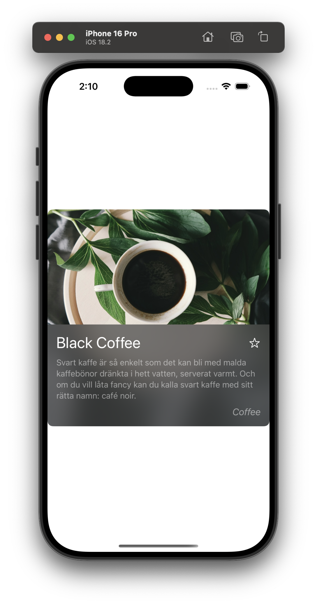

# Step 0: ベースコードを確認しよう

このステップでは、最初に用意されたベースコードを確認します。
コードを実際に動かしながら、どのような仕組みで画面が表示されるのかを理解しましょう。

---

## 📱 アプリを起動してみよう

まずは、用意されたアプリを実行してみましょう。

### 1. プロジェクトを開く
以下の手順で Xcode を起動します。

```sh
open ChallengeProjects/NetworkedApp/NetworkedApp.xcodeproj
```

もしくは、Finder で `ChallengeProjects/NetworkedApp/` を開いて
`NetworkedApp.xcodeproj` をダブルクリックしてください。

### 2. シミュレーターでアプリを実行する
- Xcode の画面左上の **再生ボタン ▶️** を押す。
- シミュレーターにアプリが表示される。
- **コーヒーのカード** が 1 つ表示されていることを確認する。



---

## 🏗 どのように画面が表示されているのか？

アプリを開くと **コーヒーの情報が書かれたカード** が 1 つ表示されましたね！
この仕組みを **コードを見ながら** 理解していきましょう。

---

## 📁 プロジェクトのファイル構成

```
NetworkedApp/
├── NetworkedApp.xcodeproj        # Xcodeプロジェクトファイル
├── NetworkedApp/                 # アプリのコード
│   ├── NetworkedApp.swift        # アプリのエントリーポイント
│   ├── CoffeeListView.swift      # コーヒーの一覧を表示する画面
│   ├── CoffeeItemView.swift      # コーヒー1つ分の表示（アイテムセル）
│   ├── Coffee.swift              # コーヒーのデータ構造（構造体）
│   ├── Assets.xcassets/          # 画像やアイコンを管理する
│   ├── Preview Content/          # Xcodeのプレビュー用のデータ
│   ├── Documents/                 # 説明用ドキュメント
│   │   ├── coffee_hot.json        # 利用するAPIのレスポンスJSON例
│   │   ├── Step0/                 # ワークショップのStep 0に対応する資料
│   │   ├── Step1/                 # ワークショップのStep 1に対応する資料
│   │   ├── Step2/                 # ワークショップのStep 2に対応する資料
│   │   ├── Step3/                 # ワークショップのStep 3に対応する資料
│   │   ├── Step4/                 # ワークショップのStep 4に対応する資料
│   │   └── Step5/                 # ワークショップのStep 5に対応する資料
│   └── README.md                 # このプロジェクトの説明
```

---

## 📌 エントリーポイント（最初に動くコード）を確認しよう

アプリが動き始めるとき、まず **どの画面を表示するのか** を決めるコードが実行されます。
そのコードが **NetworkedApp.swift** に書かれています。

```swift
import SwiftUI

@main
struct NetworkedApp: App {
    var body: some Scene {
        WindowGroup {
            CoffeeItemView()
        }
    }
}
```

### このコードの意味
- **`@main`**
  - ここが **アプリのスタート地点** だと Swift に教えるための印。
- **`NetworkedApp: App`**
  - アプリ全体の設定をする **アプリ本体の構造**。
- **`WindowGroup { CoffeeItemView() }`**
  - 画面に **CoffeeItemView** を表示するように設定している。

つまり、このコードの意味は
**「アプリが起動したら `CoffeeItemView` を画面に表示する！」** ということ。

---

## 📌 CoffeeItemView のコードを見てみよう

`CoffeeItemView.swift` には、**画面に表示するコーヒーの情報** のコードが書かれています。
では、コードを見て **どのように画面が作られているのか** を理解していきましょう。

---

### 1️⃣ まずはコーヒーのデータを用意する

```swift
let coffee = Coffee(
    id: 1,
    title: "Black Coffee",
    description: "Svart kaffe är så enkelt som det kan bli med malda kaffebönor dränkta i hett vatten, serverat varmt.",
    ingredients: ["Coffee"],
    image: URL(string: "https://images.unsplash.com/photo-1494314671902-399b18174975?auto=format&fit=crop&q=80&w=1887")!
)
```

#### ここで何をしている？
- **コーヒーの情報** を変数 `coffee` に保存している。
- `title` には **コーヒーの名前**、「Black Coffee」が入っている。
- `description` には **コーヒーの説明** が入っている。
- `image` には **コーヒーの写真の URL** が入っている。

この `coffee` のデータを **画面に表示する** のが `CoffeeItemView` の役割！

---

### 2️⃣ 画面のレイアウトを作る

```swift
var body: some View {
    VStack(alignment: .leading) {
        AsyncImage(url: coffee.image) { phase in
            switch phase {
            case .empty:
                ProgressView()
            case .success(let image):
                image
                    .resizable()
                    .scaledToFill()
            case .failure:
                Image(systemName: "photo")
                    .imageScale(.large)
                    .foregroundStyle(.secondary)
            @unknown default:
                EmptyView()
            }
        }
        .frame(height: 200)
        .frame(maxWidth: .infinity)
```

#### ここで何をしている？
- **`VStack(alignment: .leading) { ... }`**
  - **縦に並ぶレイアウト** を作っている。（VStack = 縦方向の積み重ね）
- **`AsyncImage(url: coffee.image) { ... }`**
  - **インターネットから画像を読み込んで表示** する。
  - 画像が読み込めない場合は **代わりのアイコン** を表示する。

---

### 3️⃣ コーヒーの名前や説明を表示する

```swift
VStack(alignment: .leading, spacing: 10) {
    HStack {
        Text(coffee.title)
            .font(.title)
        Spacer()
        Button(action: {
            isFavorite.toggle()
        }) {
            Image(systemName: isFavorite ? "star.fill" : "star")
        }
    }
    Text(coffee.description)
        .font(.subheadline)
        .foregroundStyle(.secondary)
}
```

#### ここで何をしている？
- **`Text(coffee.title)`**
  - コーヒーの名前（例：「Black Coffee」）を **画面に表示** する。
- **`Text(coffee.description)`**
  - コーヒーの説明を **小さめのフォント** で表示する。
- **`Button(action: { isFavorite.toggle() })`**
  - 星のマークを押すと、`isFavorite` が **true/false** に変わる。
  - `isFavorite` が **true** のときは **星が塗りつぶされる**。

---

## 🎯 Step 0 のポイント
- **アプリは `NetworkedApp.swift` から始まる**
  - `WindowGroup { CoffeeItemView() }` により、`CoffeeItemView` が画面に表示される。
- **`CoffeeItemView` でコーヒーの情報を画面に表示**
  - `AsyncImage(url:)` で **インターネット上の画像** を表示。
  - `Text(coffee.title)` で **名前** を表示。
  - `Text(coffee.description)` で **説明** を表示。
- **ボタンで「お気に入り」を切り替えられる**
  - 星マークを押すと `isFavorite` が変わる。

---

## 🔜 次のステップ
次のステップでは、**コーヒーのアイテムを複数並べてリストを作る** ことに挑戦します！
現在は **1つのコーヒー** だけが表示されているので、次のステップで **複数のアイテムを表示** できるようにしましょう。

➡️ [Step 1 - アイテムセルを複数個縦に並べる](./Step1.md)
