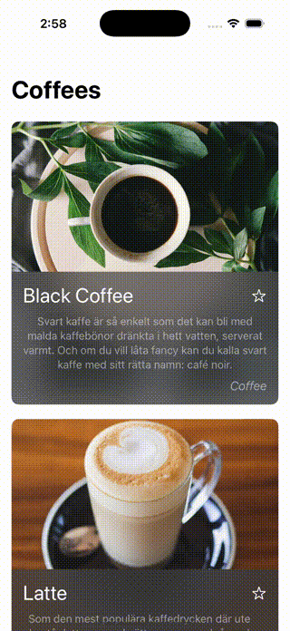

# Step 4 - アイテムをタップしたらアイテム詳細画面へ遷移してみよう

## 🎯 目的
Step 3 では、サーバー（API）から取得したコーヒーのデータをリスト形式で画面に表示しました。
しかし、今の状態では、コーヒーの詳細情報を確認することができません。

このステップでは、**リストのアイテムをタップすると詳細画面に遷移する機能** を追加します。



---

## 📌 何をするの？
1. **`NavigationStack` を追加して、画面遷移を管理する**
2. **`NavigationLink` を使って、アイテムをタップすると詳細画面へ移動できるようにする**
3. **詳細画面 `CoffeeDetailView` を作成し、アイテムの詳細情報を表示する**

---

## `NavigationStack` と `NavigationLink` の説明

### NavigationStack
- 役割:
  - 画面遷移の階層構造を管理するためのコンテナ。
  - 親画面から子画面への遷移や、戻るボタンの操作を自動でサポートします。
- 使い方:
  - 他のビューを`NavigationStack`内に配置するだけで、簡単に遷移可能な構造を作れます。
  - 例:
    ```swift
    NavigationStack {
        Text("This is the main view")
    }
    ```

### NavigationLink
- 役割:
  - タップなどのアクションで別のビューに遷移するリンクを作成。
  - 遷移先のビューを`destination`パラメータで指定します。
- 使い方:
  - タップ可能な要素（例: `Text`, `Button`など）を`NavigationLink`でラップして使用します。
  - 例:
    ```swift
    NavigationStack {
        NavigationLink(destination: Text("Detail View")) {
            Text("Go to Detail")
        }
        .padding()
    }
    ```

---

## 🛠 実装手順

### 1. `NavigationStack` を追加する
画面遷移を管理するために、`CoffeeListView` を **`NavigationStack`** で囲みます。

**編集するファイル: `CoffeeListView.swift`**

```swift
import SwiftUI

struct CoffeeListView: View {
    @State private var coffees: [Coffee] = [] // サーバーから取得するコーヒー一覧データ

    var body: some View {
        NavigationStack { // ← NavigationStackを追加して画面遷移を管理
            ScrollView {
                LazyVStack(spacing: 20) {
                    ForEach(coffees) { coffee in
                        NavigationLink(destination: CoffeeDetailView(coffee: coffee)) {
                            // ← アイテムをタップすると詳細画面へ遷移
                            CoffeeItemView(coffee: coffee)
                                .padding(.horizontal)
                        }
                    }
                }
                .padding(.vertical)
            }
            .navigationTitle("Coffees") // ← 画面上部にタイトルを追加
        }
        .task {
            do {
                coffees = try await getCoffees()
            } catch {
                print("Failed to fetch coffees: \(error)")
            }
        }
    }

    // MARK: - APIデータ取得メソッド
    func getCoffees() async throws -> [Coffee] {
        guard let url = URL(string: "https://api.sampleapis.com/coffee/hot") else { return [] }
        let (data, _) = try await URLSession.shared.data(from: url)
        let coffees = try JSONDecoder().decode([Coffee].self, from: data)
        return coffees
    }
}

#Preview {
    CoffeeListView()
}
```

🔹 **追加したポイント**
- `NavigationStack {}` で **全体を包む** ことで、画面遷移を管理できるようになった
- `.navigationTitle("Coffees")` で **画面の上部にタイトル** を追加した
- `NavigationLink(destination: CoffeeDetailView(coffee: coffee))` を使って、
  **アイテムをタップすると詳細画面に移動するようにした**

---

### 2. `CoffeeDetailView` を作成する
詳細画面を表示する `CoffeeDetailView.swift` を **新しく作成** し、
選択されたコーヒーの詳細情報を表示できるようにします。

**作成するファイル: `CoffeeDetailView.swift`**

```swift
import SwiftUI

struct CoffeeDetailView: View {
    let coffee: Coffee

    var body: some View {
        VStack {
            Text(coffee.title)
                .font(.largeTitle)
                .padding()
        }
        .navigationTitle(coffee.title)
        .navigationBarTitleDisplayMode(.inline)
    }
}

#Preview {
    let coffee = Coffee(
        id: 1,
        title: "Black Coffee",
        description: "Svart kaffe är så enkelt som det kan bli med malda kaffebönor dränkta i hett vatten, serverat varmt。.
        ingredients: ["Coffee"],
        image: URL(string: "https://images.unsplash.com/photo-1494314671902-399b18174975?auto=format&fit=crop&q=80&w=1887&ixlib=rb-4.0.3&ixid=M3wxMjA3fDB8MHxwaG90by1wYWdlfHx8fGVufDB8fHx8fA%3D%3D")!
    )
    CoffeeDetailView(coffee: coffee)
}
```

**ここではコードを変更していません！**
この `CoffeeDetailView` はそのまま使います。

---

### 3. `NetworkedApp.swift` の変更
アプリのエントリーポイントで `CoffeeListView` を使うようにします。

**編集するファイル: `NetworkedApp.swift`**

```swift
import SwiftUI

@main
struct NetworkedApp: App {
    var body: some Scene {
        WindowGroup {
            CoffeeListView() // ← アプリ起動時にリスト画面を表示
        }
    }
}
```

---

## ✅ 完成後のコード

### `CoffeeListView.swift`
```swift
import SwiftUI

struct CoffeeListView: View {
    @State private var coffees: [Coffee] = []

    var body: some View {
        NavigationStack {
            ScrollView {
                LazyVStack(spacing: 20) {
                    ForEach(coffees) { coffee in
                        NavigationLink(destination: CoffeeDetailView(coffee: coffee)) {
                            CoffeeItemView(coffee: coffee)
                                .padding(.horizontal)
                        }
                    }
                }
                .padding(.vertical)
            }
            .navigationTitle("Coffees")
        }
        .task {
            do {
                coffees = try await getCoffees()
            } catch {
                print("Failed to fetch coffees: \(error)")
            }
        }
    }

    func getCoffees() async throws -> [Coffee] {
        guard let url = URL(string: "https://api.sampleapis.com/coffee/hot") else { return [] }
        let (data, _) = try await URLSession.shared.data(from: url)
        let coffees = try JSONDecoder().decode([Coffee].self, from: data)
        return coffees
    }
}

#Preview {
    CoffeeListView()
}
```

---

### `CoffeeDetailView.swift`
```swift
import SwiftUI

struct CoffeeDetailView: View {
    let coffee: Coffee

    var body: some View {
        VStack {
            Text(coffee.title)
                .font(.largeTitle)
                .padding()
        }
        .navigationTitle(coffee.title)
        .navigationBarTitleDisplayMode(.inline)
    }
}

#Preview {
    let coffee = Coffee(
        id: 1,
        title: "Black Coffee",
        description: "Svart kaffe är så enkelt som det kan bli med malda kaffebönor dränkta i hett vatten, serverat varmt.",
        ingredients: ["Coffee"],
        image: URL(string: "https://images.unsplash.com/photo-1494314671902-399b18174975?auto=format&fit=crop&q=80&w=1887&ixlib=rb-4.0.3&ixid=M3wxMjA3fDB8MHxwaG90by1wYWdlfHx8fGVufDB8fHx8fA%3D%3D")!
    )
    CoffeeDetailView(coffee: coffee)
}
```

---

## ⏭️ 次のステップ
次は、 **タブを追加して、画面を切り替えられるようにする** 方法を学びます！

➡️ [Step 5 - タブをつける](./Step5.md)
