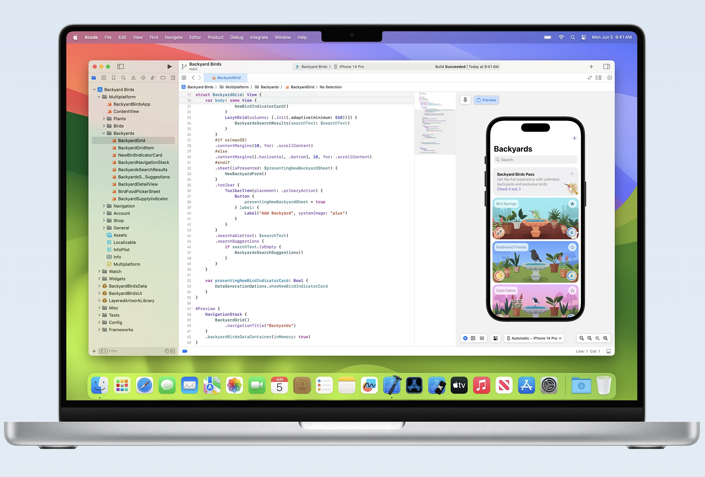
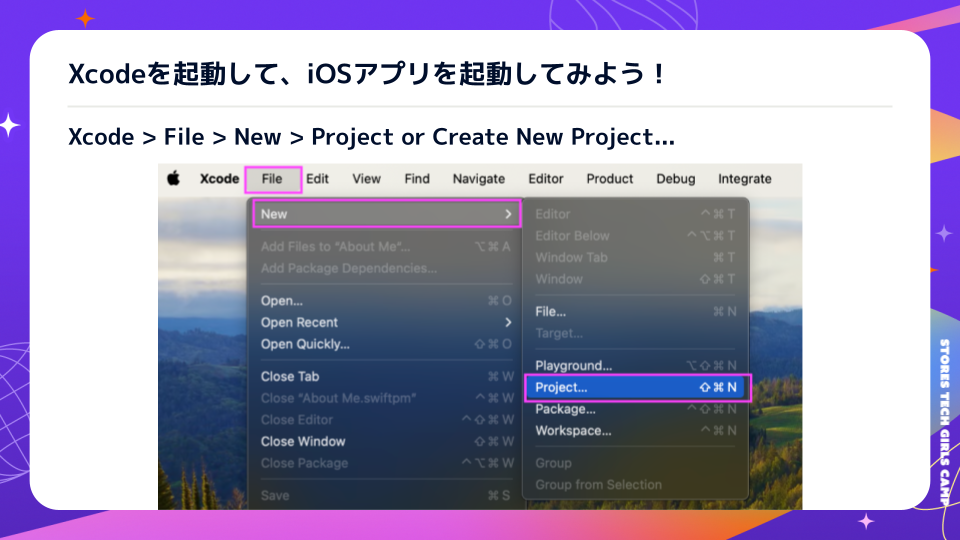
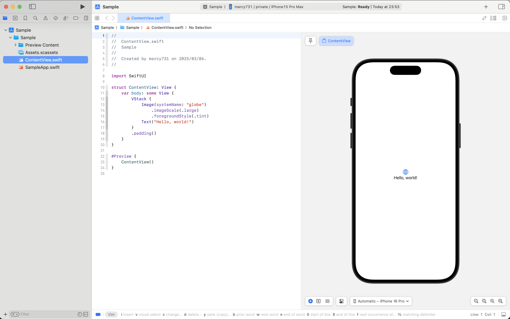
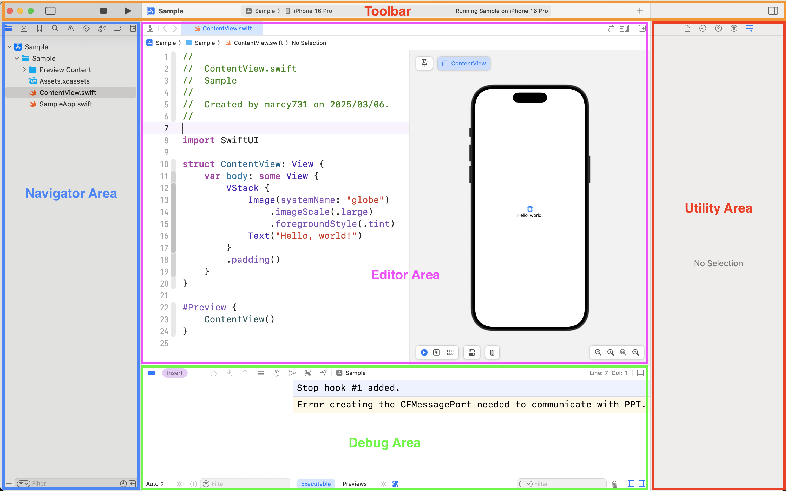
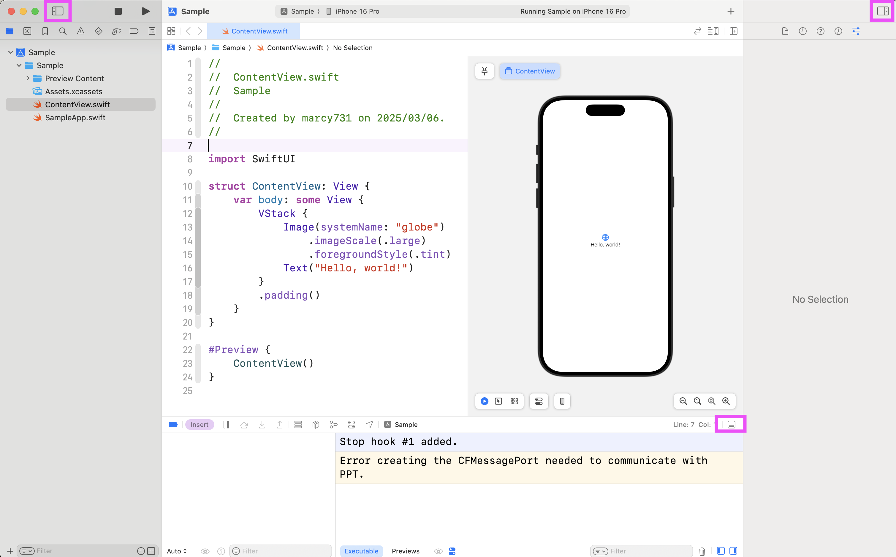
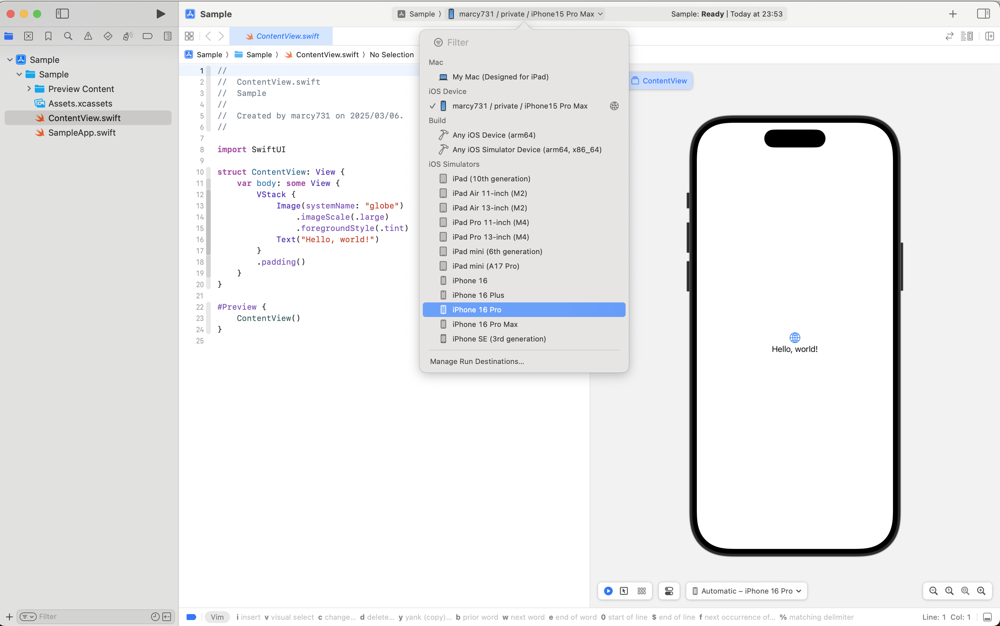
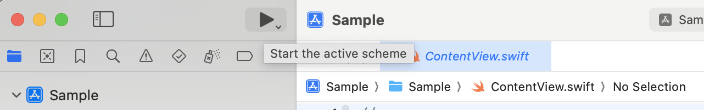
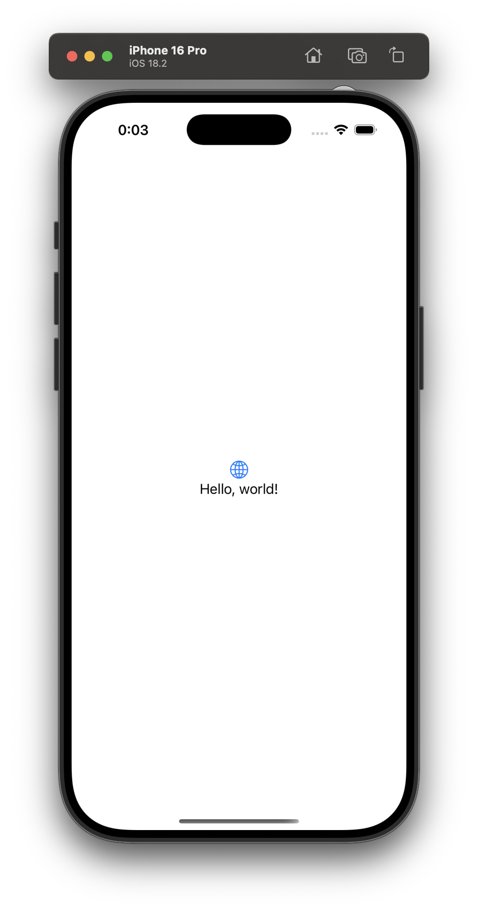

# 🛠 Xcode をセットアップしよう

このセクションでは、iOSアプリを開発するためのツール Xcode のセットアップ方法を学びます。  
Xcode は Apple が提供する統合開発環境（IDE）で、iPhoneアプリを作るために必須のツールです。  

---

## 🎯 目標
- Xcode とは何かを理解する  
- Xcode をインストールし、プロジェクトを作成する方法を学ぶ  
- iOS シミュレーターを使ってアプリを実行する  

---

## 🖥 Xcode とは？

Xcode は、Apple が開発・提供している iOSアプリ開発のための統合開発環境（IDE）です。  


Xcode を使うことで、以下のような作業ができます。

- Swift や SwiftUI を使って iOSアプリを作成  
- シミュレーターを使ってアプリを仮想デバイス上でテスト  
- デバッグツールを使ってエラーを修正  
- App Store への配信も可能  

Xcode は Mac でのみ利用可能で、Windows では動作しません。

Link: https://developer.apple.com/jp/xcode/



---

## ⬇️ Xcode のインストール

### 1. App Store からインストール
1. Mac の App Store を開く  
2. 「Xcode」と検索  
3. Xcode をダウンロード（サイズが大きいため、時間がかかる場合があります）  
4. インストールが完了したら、Launchpad から Xcode を開く  

### 2. コマンドラインツールを確認
Xcode のインストール後、ターミナルを開いて以下のコマンドを実行し、コマンドラインツール（CLT）がインストールされているか確認します。

```sh
xcode-select --install
```

このコマンドを実行すると、インストールの確認ダイアログが表示されることがあります。  
もし表示されたら「インストール」をクリックしてください。  

---

## 📂 新しい Xcode プロジェクトを作成しよう

### 1. Xcode を起動する
インストールが完了したら、Xcode を開きます。

1. Xcode を起動  
2. 「Create a new Xcode project」を選択  or 「Xcode > File > Project」を選択



### 2. プロジェクトの設定
プロジェクト作成画面が表示されたら、以下のように設定します。

1. 「iOS」タブを選択  
2. 「App」を選択して Next をクリック  
3. プロジェクト情報を入力  
   - Product Name（アプリの名前）: `Sample`  
   - Team: （未設定のままでOK）  
   - Organization Identifier: `inc.st`  
   - Interface: SwiftUI  
   - Language: Swift  
   - Testing System: None
   - Storage: None
4. 保存場所を選択し、「Create」をクリック  
   - 「Create Git repository on my Mac」のチェックを外す

プロジェクトが作成されると、Xcode のメイン画面が表示されます。  
これで iOS アプリの開発準備が整いました。  



---

## 🛠 Xcode の使い方

Xcode は、多くの機能が詰め込まれた **統合開発環境（IDE）** です。
画面の各エリアの意味を知っておくと、よりスムーズに開発が進められます。

### 🔍 Xcode の画面構成

Xcode の画面は **大きく5つのエリア** に分かれています。

| エリア名 | 役割 |
|----------|------|
| **Navigator Area** | プロジェクト内のファイルやエラーを管理する |
| **Editor Area** | コードを編集するメインのエリア |
| **Toolbar** | ビルド、実行、デバッグなどの操作を行う |
| **Debug Area** | アプリの実行中にログや変数の状態を確認する |
| **Utility Area** | UIの設定やコードのプロパティを管理する |



もし各Areaが表示されていな場合、以下のアイコンをタップしてみてください。



### 📂 **Navigator Area（ナビゲーターエリア）**
画面の **左側** にあるエリアで、プロジェクト内のファイルを管理します。

💡 よく使うナビゲーター
- **Project Navigator**（📁 アイコン） → ファイル一覧を表示
- **Issue Navigator**（⚠️ アイコン） → エラーや警告を表示
- **Debug Navigator**（📊 アイコン） → メモリ使用量やCPU負荷を確認

### ✏️ **Editor Area（エディターエリア）**
Xcode の **中央** にある、コードを書くメインのエリアです。

💡 ここでできること
- Swift のコードを編集
- SwiftUI のプレビューを確認（右上の「Resume」ボタン）
- Storyboard で UI をデザイン

### 🎛 **Toolbar（ツールバー）**
画面の **上部** にある、プロジェクトの実行や設定を管理するバーです。

💡 よく使うボタン
- ▶️ **Run（実行ボタン）** → アプリをシミュレーターで実行
- ■ **Stop（停止ボタン）** → 実行中のアプリを停止
- 🛠 **Scheme（スキーム）選択** → どのデバイスで実行するか選ぶ

### 🕵️ **Debug Area（デバッグエリア）**
画面の **下部** にある、アプリの動作やエラーを確認できるエリアです。

💡 よく使う機能
- **Console（コンソール）** → `print("デバッグメッセージ")` で出力を確認
- **Variables（変数ウォッチ）** → 実行中の変数の値を表示
- **Breakpoints（ブレークポイント）** → コードの実行を一時停止

### 🛠 **Utility Area（ユーティリティエリア）**
画面の **右側** にある、ファイルのプロパティや UI の設定を管理するエリアです。

💡 よく使うパネル
- **Inspector** → UIの色やフォントを変更
- **Library**（`+` ボタン） → SwiftUI の `Button` や `Text` を追加

---

## 📱 iOS シミュレーターでアプリを実行しよう

Xcode には iOS シミュレーターという仮想デバイスが用意されています。  
これを使うと、iPhone を持っていなくてもアプリを動作確認できます。

### 1. シミュレーターを選択する
1. Xcode 上部のツールバーにある「実行ターゲット（iPhone 16 Pro など）」をクリック  
2. 「iOS Simulator」から好きな iPhone のモデルを選択  



### 2. アプリを実行する
1. 上部の「▶︎（再生ボタン）」をクリック（または `Command + R` を押す）  
2. シミュレーターが起動し、アプリが動作する  



画面に「Hello, world!」という文字が表示されれば成功です 🎉



---

## ✅ まとめ
- Xcode は iOS アプリを開発するためのツール  
- Mac の App Store から Xcode をダウンロードし、セットアップできる  
- SwiftUI を使った新しいプロジェクトを作成できる  
- iOS シミュレーターを使ってアプリを実行できる  

次のステップでは、実際に SwiftUI を使って最初のアプリを作ってみます。  

➡️ [次へ: 最初のアプリを作ってみよう](./03_first_app.md)
