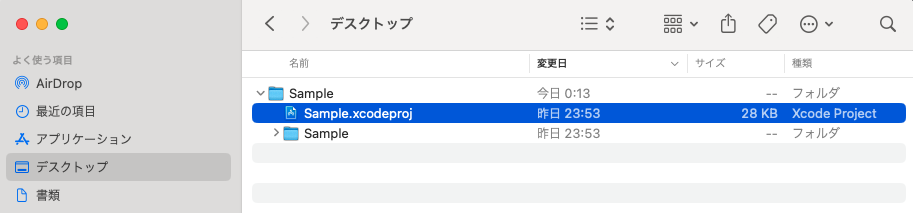
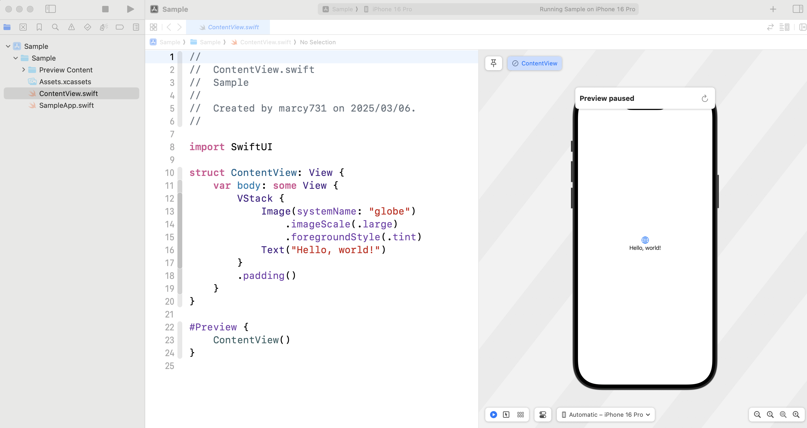
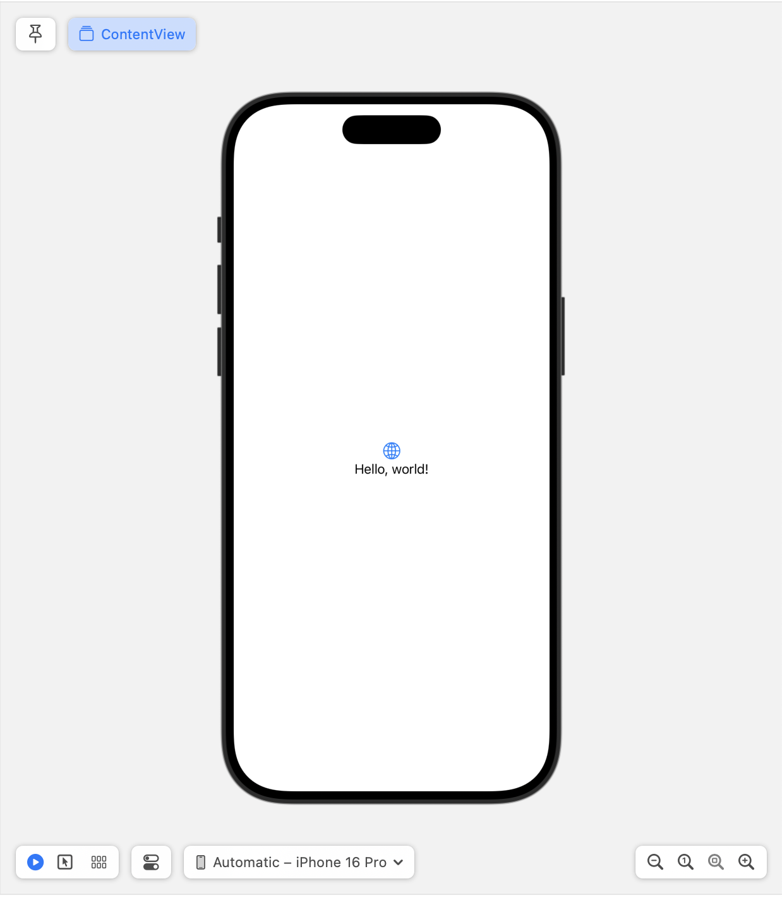
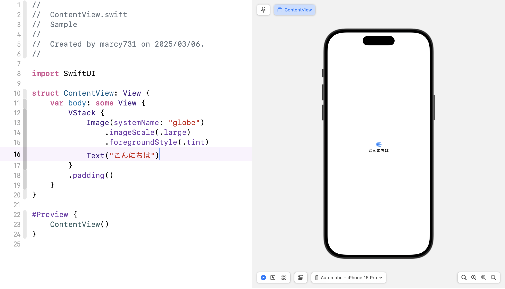
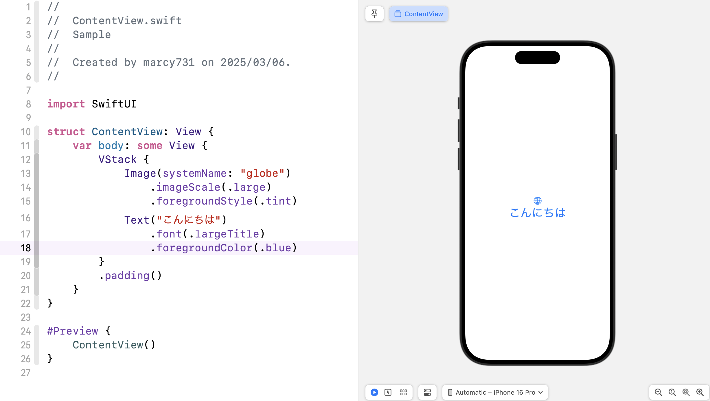

# 🏗 最初のアプリを作ってみよう

このセクションでは、Xcode を使って簡単な iOS アプリを作成します。  
SwiftUI を使い、画面にテキストを表示するシンプルなアプリを作ります。

---

## 🎯 目標
- Xcode の基本的な使い方を学ぶ  
- SwiftUI を使って画面にテキストを表示する  
- コードを変更してアプリをカスタマイズする  

---

## 📂 プロジェクトを開こう

前のセクションで作成した Xcode プロジェクトを開きます。  
プロジェクト名は `SampleApp` にしているはずです。

1. Finder で `SapmleApp` のフォルダを開く  
2. `SampleApp.xcodeproj` をダブルクリックして Xcode を起動  



Xcode が開いたら、画面左側の「Navigator」から `ContentView.swift` を選択します。  
このファイルがアプリのメイン画面を定義する SwiftUI のコードです。



---

## 📜 初期コードを確認しよう

`ContentView.swift` の中身を見てみましょう。

```swift
import SwiftUI

struct ContentView: View {
    var body: some View {
        VStack {
            Image(systemName: "globe")
                .imageScale(.large)
                .foregroundStyle(.tint)
            Text("Hello, world!")
        }
        .padding()
    }
}

#Preview {
    ContentView()
}
```

このコードは、画面に「Hello, world!」というテキストを表示するものです。  
コードの意味を簡単に説明します。

- `import SwiftUI`  
  SwiftUI のフレームワークを使うための宣言  

- `struct ContentView: View`  
  SwiftUI の画面（View）を定義する  

- `var body: some View`  
  画面のレイアウトを指定する  

- `VStack`  
    {}内を縦に並べて表示する

- `Text("Hello, world!")`  
  画面に「Hello, world!」という文字を表示する  

- `#Preview { ContentView() }`  
  Xcode のプレビュー機能で画面を確認するための設定  

---

## 🖥 プレビューを使ってみよう

Xcode には、SwiftUI の画面をすぐに確認できる「プレビュー」機能があります。  
プレビューを使うと、アプリを実行しなくてもコードの変更をすぐに確認できます。

### 1. プレビューを開く
1. `ContentView.swift` を開く  
2. 右側のCanvasエリア下部にある「▶︎（再生ボタン）」をクリック（または `Command + Option + P` を押す）  
3. 画面に「Hello, world!」が表示される  




### 2. プレビューが表示されない場合
プレビューがうまく表示されない場合は、以下を試してみてください。

- Xcode を再起動する  
- `ContentView.swift` を開いた状態で `Command + Option + P` を押す  
- 「Try Again」ボタンをクリックする  

---

## ✏️ コードを変更してみよう

画面に表示されるテキストを変更してみます。  
`Text("Hello, world!")` の部分を `Text("こんにちは")` に書き換えてみましょう。

```swift
import SwiftUI

struct ContentView: View {
    var body: some View {
        VStack {
            Image(systemName: "globe")
                .imageScale(.large)
                .foregroundStyle(.tint)
            Text("こんにちは")
        }
        .padding()
    }
}

#Preview {
    ContentView()
}
```

変更後に `Command + Option + P` を押すと、プレビューに「こんにちは」と表示されます。



---

## 🎨 文字のデザインを変えてみよう

テキストのフォントサイズや色を変更できます。  
以下のように `.font()` や `.foregroundColor()` を追加してみましょう。

```swift
import SwiftUI

struct ContentView: View {
    var body: some View {
        VStack {
            Image(systemName: "globe")
                .imageScale(.large)
                .foregroundStyle(.tint)
            Text("こんにちは")
                .font(.largeTitle)
                .foregroundColor(.blue)
        }
        .padding()
    }
}

#Preview {
    ContentView()
}
```

- `.font(.largeTitle)` → 文字を大きくする  
- `.foregroundColor(.blue)` → 文字の色を青にする  

プレビューを更新すると、デザインが変わったことがわかります。



---

## ✅ まとめ
- SwiftUI を使って簡単なアプリを作成できる  
- `Text()` を使って画面に文字を表示できる  
- `.font()` や `.foregroundColor()` を使ってデザインを変更できる  
- Xcode のプレビュー機能を使うと、すぐに変更を確認できる  

次のステップでは、SwiftUI の基本レイアウトを学びます。  
画面に複数の要素を配置する方法を試してみましょう。

➡️ [次へ: SwiftUIの基本を学ぼう](./04_swiftui_basics.md)
