# 🏗 SwiftUIの基本を学ぼう

このセクションでは、SwiftUIの基本的なレイアウトを学びます。  
SwiftUIを使うと、簡単にUIを構築できます。  
ここでは、複数の要素を配置するためのレイアウトコンテナを使って、  
実際にコードを書きながら学んでいきます。

---

## 🎯 目標
- SwiftUIの基本的なレイアウトを理解する  
- VStack, HStack, ZStack の使い方を学ぶ  
- 画面に複数の要素を配置する方法を実践する  
- SwiftUI の Modifier とは何かを理解する  
- Modifier を使ってビューの見た目を変更する方法を学ぶ  
- よく使う Modifier の具体的なコード例を実践する  

---

## 📚 SwiftUIのレイアウトコンテナ

SwiftUIでは、画面の要素を並べるために  
**VStack（垂直）、HStack（水平）、ZStack（重ねる）** の3つのレイアウトコンテナを使います。

SampleAppのContentViewを自由に書き換えてSwiftUIでのレイアウトを学んでみよう。

---

## 🏗 VStack（縦に並べる）

`VStack` は、画面の要素を **縦に** 並べるためのコンテナです。

```swift
struct ContentView: View {
    var body: some View {
        VStack {
            Text("上のテキスト")
            Text("下のテキスト")
        }
    }
}
```

- VStack の中に `Text()` を2つ配置すると、**縦に並ぶ**
- `VStack { ... }` の中に複数のビューを入れることで、簡単にレイアウトできる

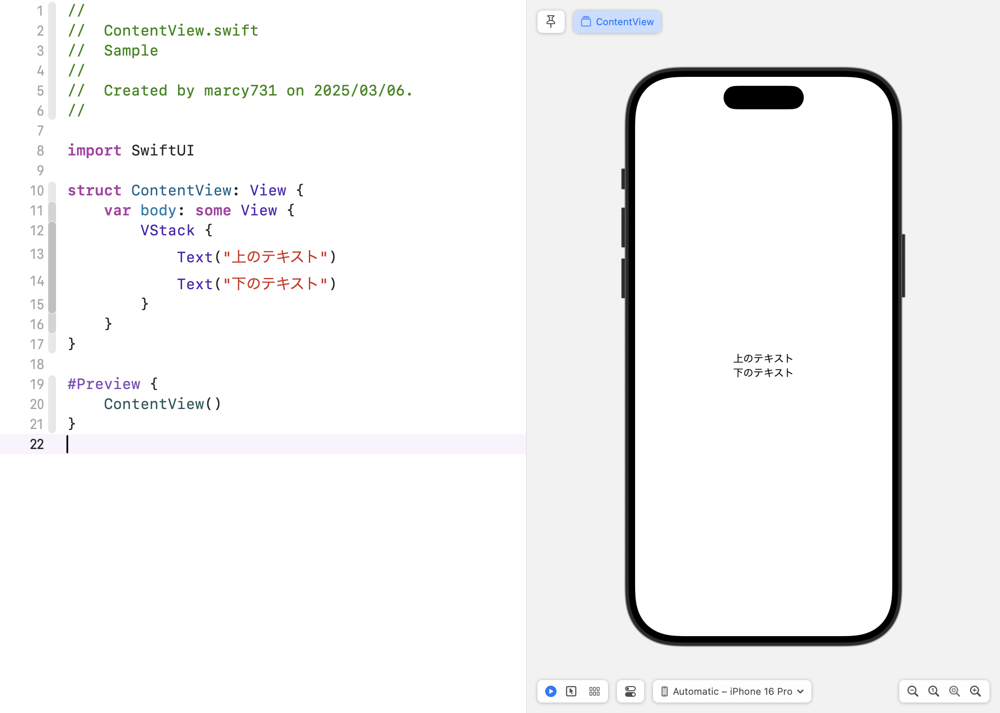

### 間隔を調整する
`spacing` を指定すると、要素の間隔を変更できます。

```swift
VStack(spacing: 20) {
    Text("上のテキスト")
    Text("下のテキスト")
}
```

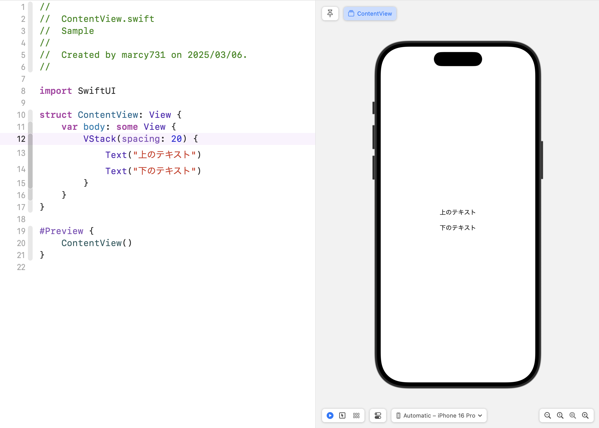

---

## 🏗 HStack（横に並べる）

`HStack` は、画面の要素を **横に** 並べるためのコンテナです。

```swift
struct ContentView: View {
    var body: some View {
        HStack {
            Text("左")
            Text("中央")
            Text("右")
        }
    }
}
```

- `HStack` を使うと、要素が **水平方向に並ぶ**
- `VStack` と組み合わせてレイアウトを作ることが多い

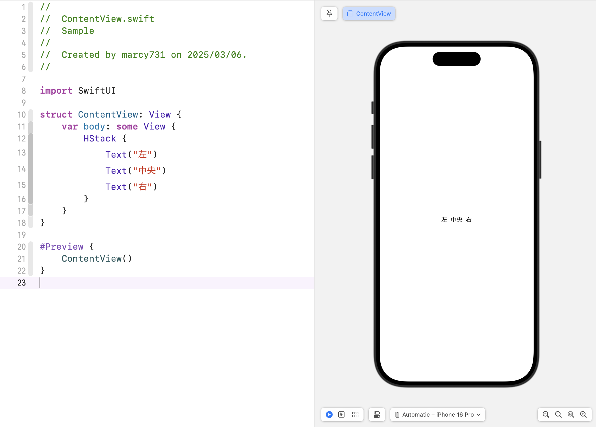

### 間隔を調整する
`spacing` を使って、要素の間隔を調整できます。

```swift
HStack(spacing: 30) {
    Text("左")
    Text("中央")
    Text("右")
}
```

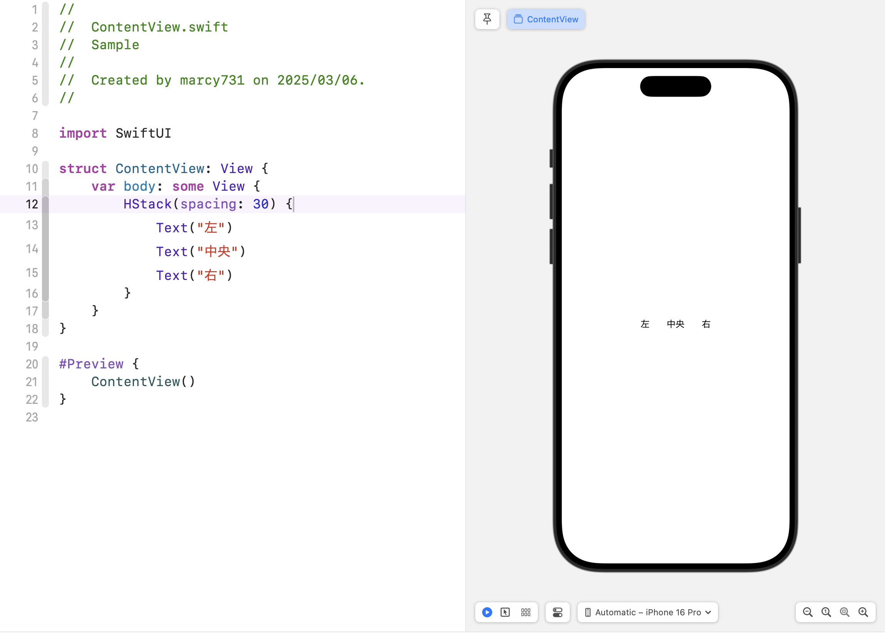

---

## 🏗 ZStack（重ねて配置）

`ZStack` は、要素を **重ねる** ためのコンテナです。

```swift
struct ContentView: View {
    var body: some View {
        ZStack {
            Rectangle()
                .fill(Color.blue)
                .frame(width: 200, height: 100)
            Text("前面のテキスト")
                .foregroundColor(.white)
        }
    }
}
```

- `ZStack` の中にあるビューは **上から順に** 配置される
- **背景とテキスト** のように、要素を重ねたいときに使う

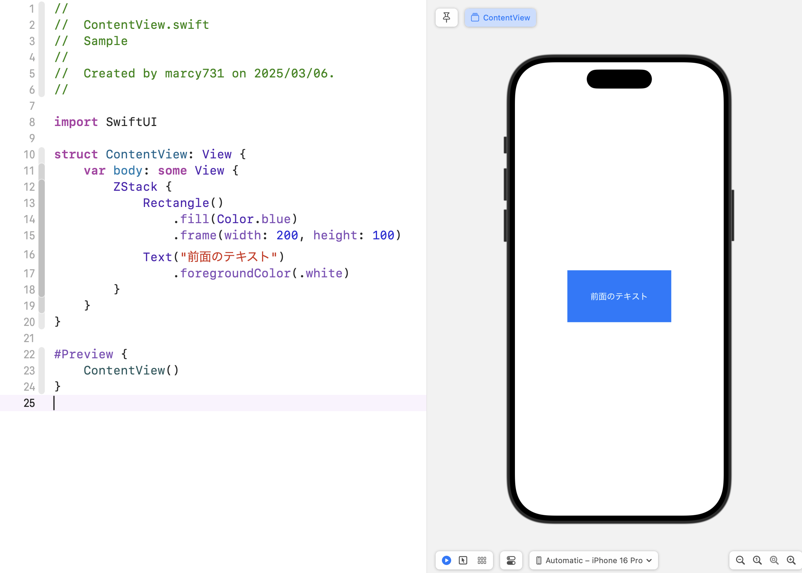

### 配置を調整する
`alignment` を指定すると、要素を揃えることができる。

```swift
ZStack(alignment: .topLeading) {
    Rectangle()
        .fill(Color.green)
        .frame(width: 200, height: 100)
    Text("左上")
        .foregroundColor(.white)
}
```

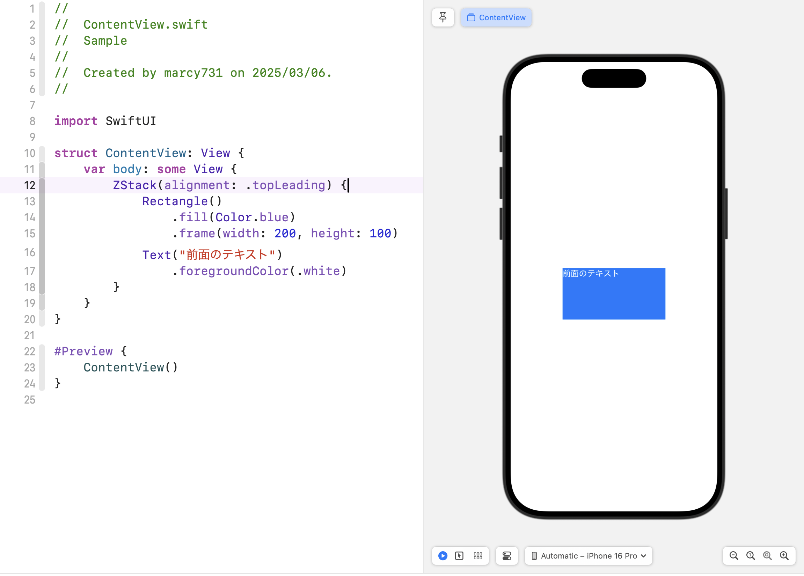

---

## 📌 VStack, HStack, ZStack の組み合わせ

実際のアプリでは、**VStack, HStack, ZStack を組み合わせて** レイアウトを作ります。  
例えば、以下のコードは **タイトル、横並びのボタン、背景のあるレイアウト** を作る例です。

```swift
struct ContentView: View {
    var body: some View {
        VStack {
            Text("タイトル")
                .font(.largeTitle)
            
            HStack {
                Text("左")
                Text("右")
            }
            .padding()
            .background(Color.yellow)
            .cornerRadius(10)
            
            ZStack {
                Rectangle()
                    .fill(Color.blue)
                    .frame(width: 200, height: 100)
                Text("前面")
                    .foregroundColor(.white)
            }
        }
    }
}
```

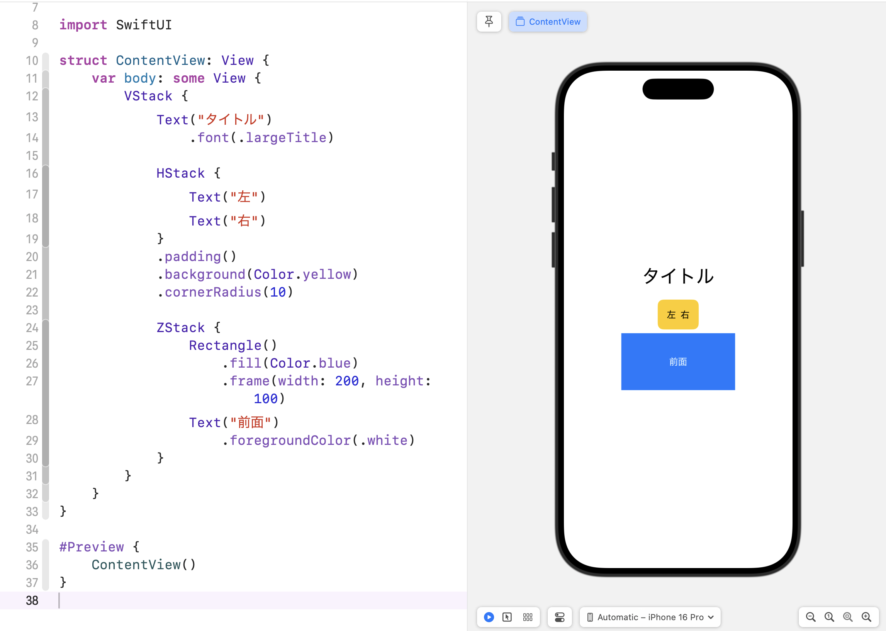

---

## 🎨 SwiftUI の Modifier を学ぼう  

SwiftUI では、**Modifier（モディファイア）** を使ってビューの見た目や動作を変更できます。  
Modifier は **背景色の変更、フォントサイズの調整、影の追加、角丸** など、  
ビューにさまざまなスタイルや動作を適用するための機能です。  


---

## ✅ Modifier とは？
Modifier は、SwiftUI のビューに **追加の設定やスタイルを適用する** ための機能です。  

💡 **Modifier の特徴**  
1. **ビューにチェーンのように追加できる**  
2. **元のビューを変更せずに、スタイルや動作を変更できる**  
3. **さまざまなビューに適用可能（Text, Image, Rectangle など）**  

例えば、次のコードでは `Text` に複数の Modifier を適用しています。

```swift
Text("Hello, SwiftUI!")
    .font(.title) // フォントサイズを変更
    .foregroundColor(.blue) // テキストの色を青に
    .padding() // 内側の余白を追加
    .background(Color.yellow) // 背景色を黄色に
    .cornerRadius(10) // 背景の角を丸くする
    .shadow(color: .gray, radius: 5, x: 2, y: 2) // 影を追加
```

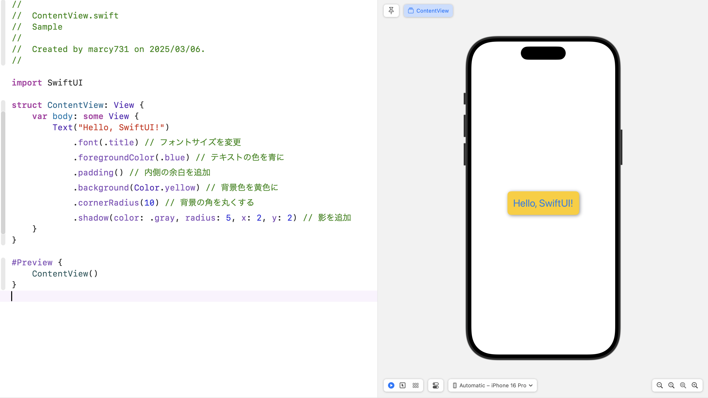

---

## 🔹 **Text に使える Modifier**
### **📌 フォントや色を変更する**
```swift
Text("SwiftUI Modifier")
    .font(.largeTitle) // フォントサイズを変更
    .foregroundColor(.red) // テキストの色を赤に
```

### **📌 文字間隔や行間を調整**
```swift
Text("文字間隔を調整")
    .kerning(5) // 文字間隔を広げる
```

```swift
Text("行間を調整\nこれは2行目")
    .lineSpacing(10) // 行間を広げる
```

### **📌 影をつける**
```swift
Text("影をつける")
    .shadow(color: .gray, radius: 5, x: 2, y: 2)
```

---

## 🔹 **画像（Image）に使える Modifier**
### **📌 サイズ変更**
```swift
Image(systemName: "star.fill")
    .resizable() // サイズ変更可能に
    .frame(width: 50, height: 50) // サイズを指定
```

### **📌 色を変更**
```swift
Image(systemName: "star.fill")
    .foregroundColor(.orange) // 星の色をオレンジに
```

### **📌 影を追加**
```swift
Image(systemName: "star.fill")
    .shadow(color: .gray, radius: 5, x: 2, y: 2)
```

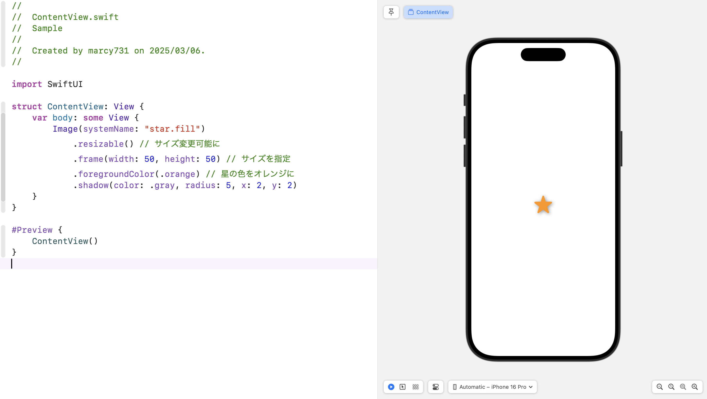

---

## 🔹 **四角形や円に使える Modifier**
### **📌 背景色と角丸**
```swift
Rectangle()
    .fill(Color.green) // 塗りつぶし色
    .frame(width: 100, height: 50)
    .cornerRadius(10) // 角を丸くする
```

### **📌 枠線をつける**
```swift
Circle()
    .stroke(Color.red, lineWidth: 4) // 赤い枠線
    .frame(width: 100, height: 100)
```

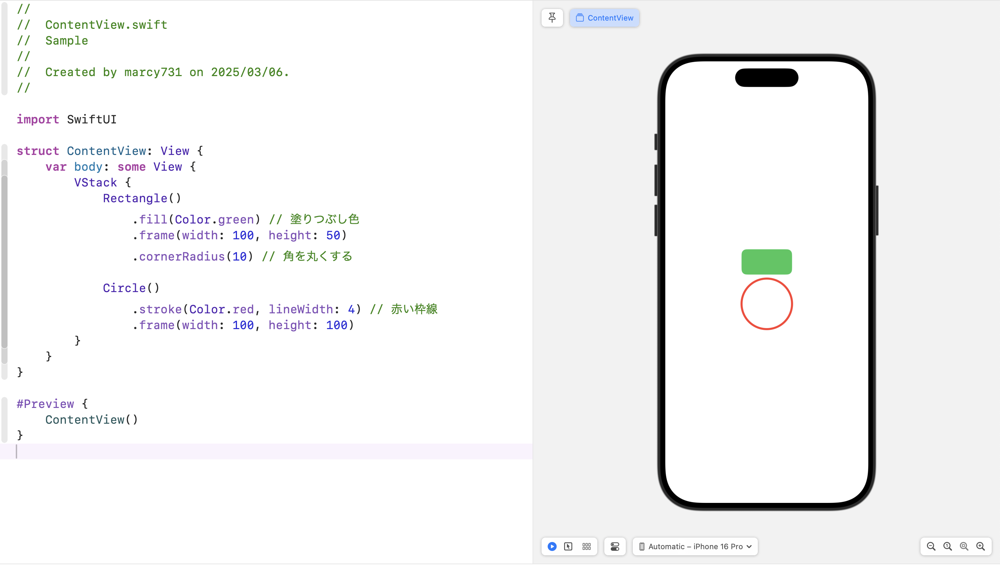

---

## 🔹 **ボタン（Button）に使える Modifier**
```swift
Button(action: {
    print("ボタンが押されました")
}) {
    Text("ボタンを押してね")
        .font(.headline)
        .foregroundColor(.white)
        .padding()
        .background(Color.blue)
        .cornerRadius(10)
        .shadow(color: .gray, radius: 5, x: 2, y: 2)
}
```

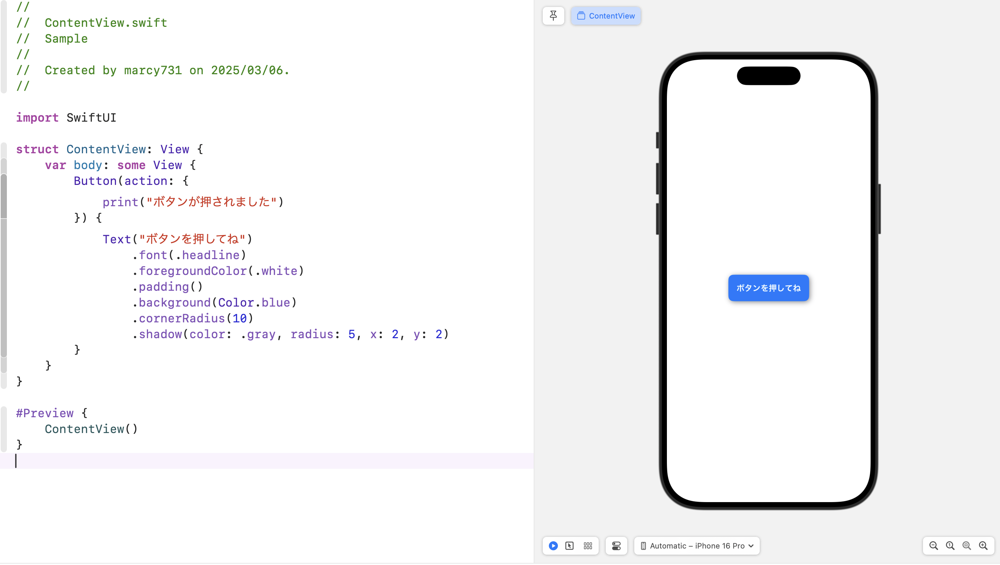

---

## 🔹 **スライダー（Slider）やトグル（Toggle）**
### **📌 スライダー**
```swift
Slider(value: $sliderValue, in: 0...1)
    .padding()
    .accentColor(.green) // スライダーの色
```

### **📌 トグル**
```swift
Toggle("トグルスイッチ", isOn: $toggleValue)
    .toggleStyle(SwitchToggleStyle(tint: .green))
```

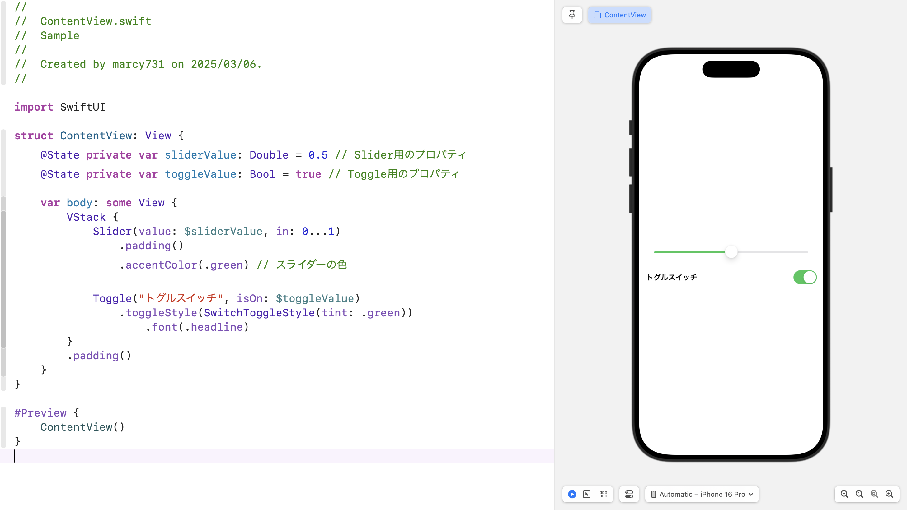

---

## 🔹 **透明度、回転、スケールの変更**
### **📌 透明度を変更**
```swift
Text("Opacity Example")
    .opacity(0.5) // 半透明にする
```

### **📌 回転する**
```swift
Text("Rotated Text")
    .rotationEffect(.degrees(45)) // 45度回転
```

### **📌 サイズを拡大・縮小**
```swift
Text("Scaled Text")
    .scaleEffect(1.5) // 1.5倍に拡大
```

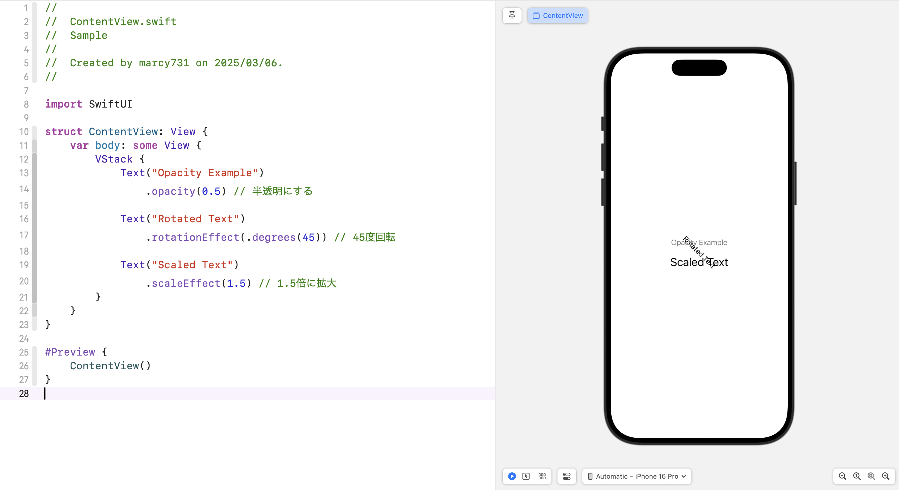

---

## 🔹 **背景とオーバーレイ（Overlay）**
### **📌 背景をつける**
```swift
Text("背景つき")
    .padding()
    .background(RoundedRectangle(cornerRadius: 10).fill(Color.green))
```

### **📌 オーバーレイを重ねる**
```swift
Rectangle()
    .fill(Color.blue)
    .frame(width: 150, height: 100)
    .overlay(
        Text("Overlay")
            .foregroundColor(.white)
            .font(.headline)
    )
```

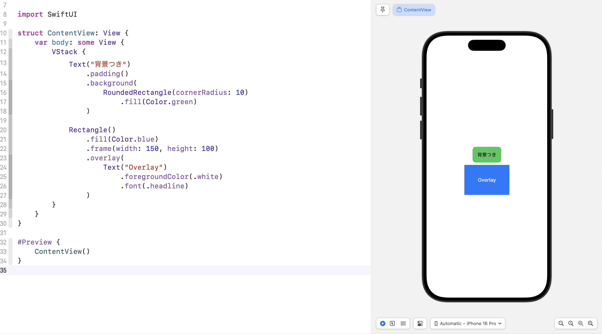

---

## ✅ まとめ
- `VStack`, `HStack`, `ZStack` を **組み合わせることで、自由にレイアウトが作れる**  
- SwiftUI の Modifier を使うと、ビューの見た目や動作を簡単に変更できる

| Modifier | 役割 |
|----------|------|
| `.font(.title)` | フォントサイズを変更 |
| `.foregroundColor(.red)` | テキストの色を変更 |
| `.padding()` | 余白を追加 |
| `.background(Color.yellow)` | 背景色をつける |
| `.cornerRadius(10)` | 角を丸くする |
| `.shadow(color: .gray, radius: 5, x: 2, y: 2)` | 影をつける |
| `.opacity(0.5)` | 透明度を変更 |
| `.rotationEffect(.degrees(45))` | 回転する |
| `.scaleEffect(1.5)` | 拡大・縮小する |


次のステップでは、実際にコードを書いてレイアウトを組む課題に挑戦します。

➡️ [次へ: SwiftUI Challenge](./05_swiftui_challenge.md)
