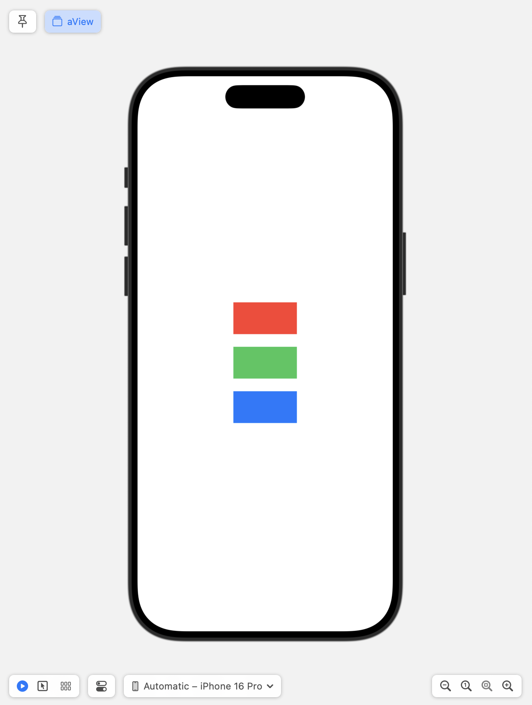
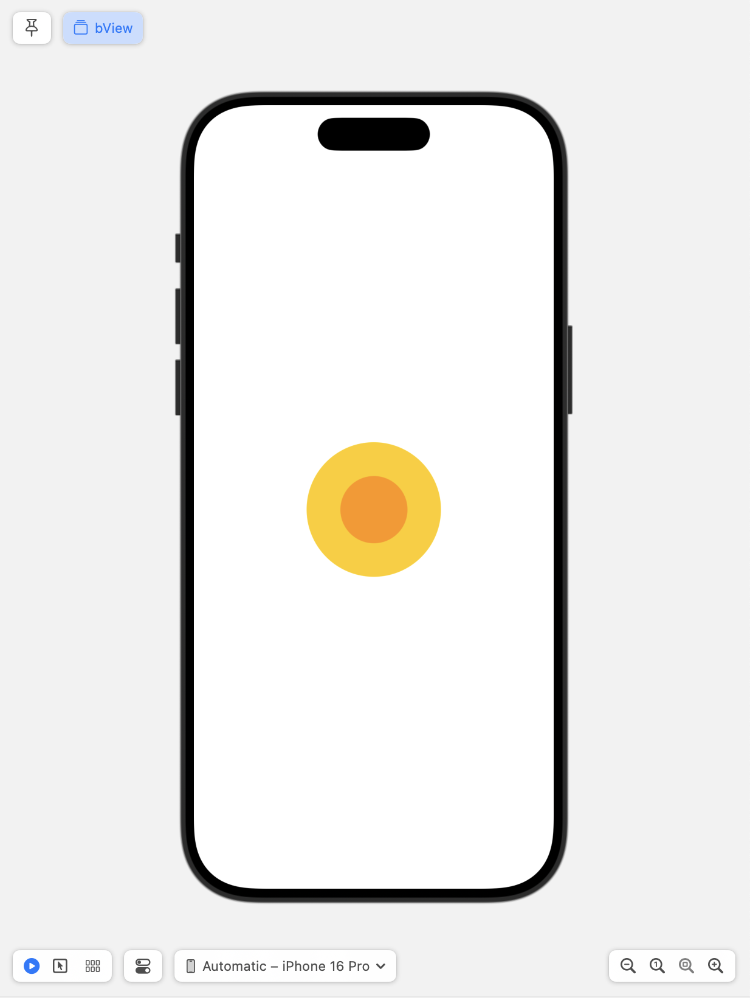
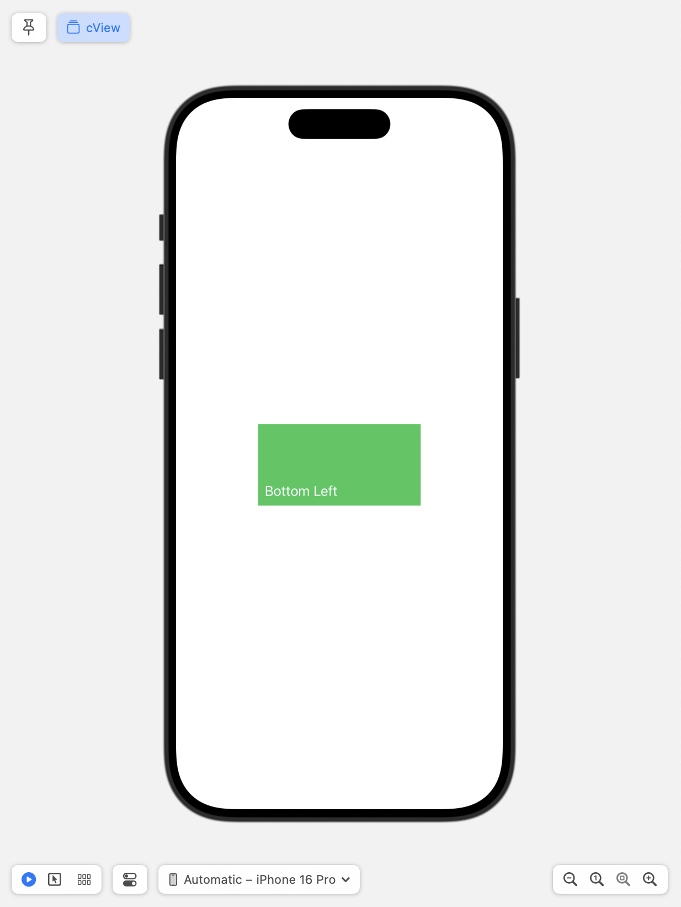
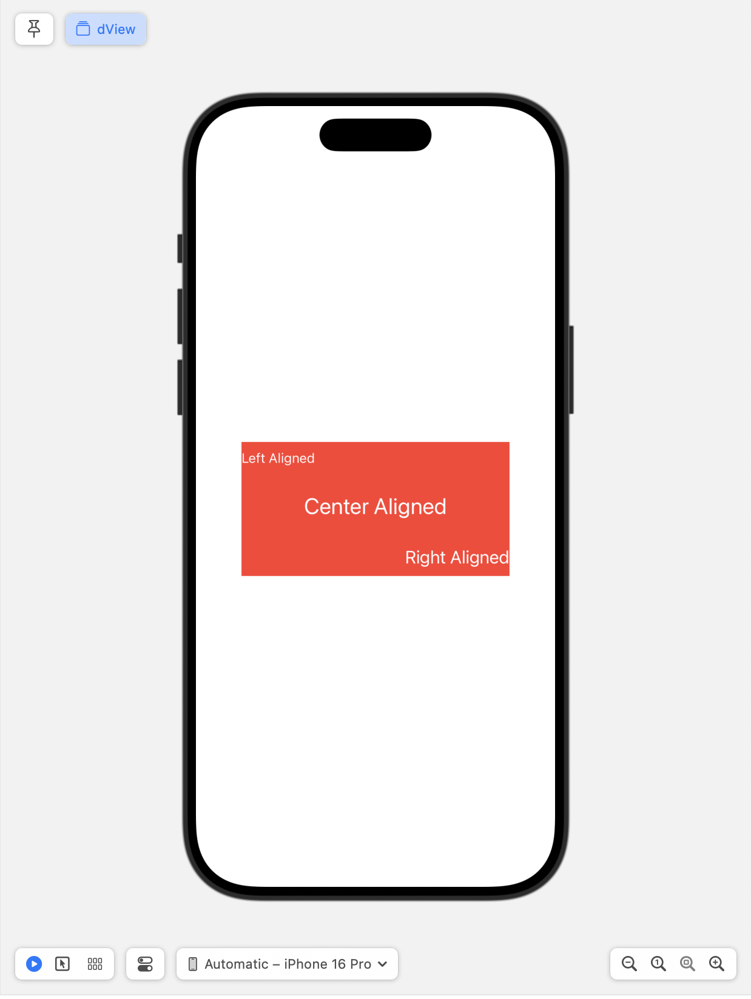
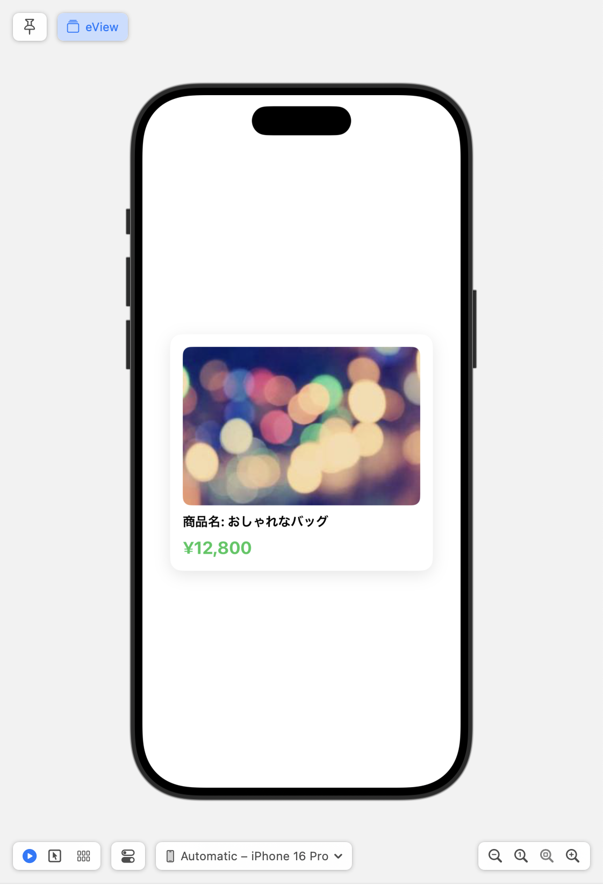

# 🎯 SwiftUI Challenge

このセクションでは、これまで学んだ SwiftUI の基本を活かして、  
自分でレイアウトを組んでみる課題に挑戦します。  
指定されたレイアウトを再現してみましょう。

---

## 🎯 目標
- SwiftUI の基本レイアウトを活用する  
- プレビューで確認しながらコードを書いてみる  

---

## 📂 プロジェクトの構成

このワークショップでは、あらかじめスタート用のプロジェクトを用意しています。
課題のレイアウトは **ChallengeProjects** に、完成版の解答例は **CompletedProjects** に用意されています。

```
📁 ChallengeProjects/
  ├── 📂 SwiftUIChallenge/      # チャレンジのスタート用プロジェクト
  │   ├── SwiftUIChallenge.xcodeproj
  │   ├── SwiftUIChallengeApp.swift
  │   ├── aView.swift           # ここに課題を実装する
  │   ├── bView.swift           # ここに課題を実装する
  │   ├── cView.swift           # ここに課題を実装する
  │   ├── dView.swift           # ここに課題を実装する
  │   ├── eView.swift           # ここに課題を実装する
  │   ├── README.md (この説明ファイル)
  │
📁 CompletedProjects/
  ├── 📂 SwiftUIChallenge/      # 完成版プロジェクト
  │   ├── SwiftUIChallenge.xcodeproj
  │   ├── SwiftUIChallengeApp.swift
  │   ├── aView.swift           # 解答例が記述されている
  │   ├── bView.swift           # 解答例が記述されている
  │   ├── cView.swift           # 解答例が記述されている
  │   ├── dView.swift           # 解答例が記述されている
  │   ├── eView.swift           # 解答例が記述されている
  │   ├── README.md
```

---

## 🏁 プロジェクトの起動

まず、スタート用のプロジェクトを開いてみましょう。

### 1. Xcode でプロジェクトを開く
以下の手順で Xcode を起動します。

Finder で `ChallengeProjects/SwiftUIChallenge/` を開いて、
`SwiftUIChallenge.xcodeproj` を **ダブルクリック** してください。

もしくはターミナルを開いて以下のコマンドを入力してください。

```sh
open ChallengeProjects/SwiftUIChallenge/SwiftUIChallenge.xcodeproj
```


---

## 🔥 チャレンジ課題

以下の画像のようなレイアウトを作ってみましょう。  
それぞれのレイアウトを **VStack, HStack, ZStack を使って再現** してください。


---

### **a. 縦に3つの色付き長方形を等間隔で配置**



**ヒント**
- 垂直方向に配置するには `VStack` を使用します。
- 長方形を作るには `Rectangle` を使いましょう。
- 色をつけるには `.fill()` 修飾子を使用します。
- 間隔を調整するには `VStack` の `spacing` パラメータを設定します。
- サイズを指定するには `.frame(width: , height:)` を使用します。

---

### **b. 二重に丸を配置**



**ヒント**
- 重ねて配置するには `ZStack` を使用します。
- 丸を作るには `Circle` を使いましょう。
- 色をつけるには `.fill()` 修飾子を使用します。
- サイズを調整するには `.frame(width: , height:)` を使用します。
- 内側の丸を外側より小さくし、色を変えると二重の丸ができます。

---

### **c. テキストを四角形の左下に配置**



**ヒント**
- 重ねて配置するには `ZStack` を使用します。
- 配置を調整するには `ZStack` の `alignment` パラメータを設定します。
  - 左下に配置するには `.bottomLeading` を指定します。
- 四角形を作るには `Rectangle` を使いましょう。
- テキストの色を変えるには `.foregroundColor()` を使用します。
- テキストと四角形の間に余白を追加するには `.padding()` を使います。

---

### **d. 四角形の中に3つのテキストを等間隔に配置（異なるアライメント）**



**ヒント**
- 四角形を背景にするには `Rectangle` を使用します。
- 四角形に別のビューを重ねるには `.overlay` 修飾子を使います。
- 垂直方向に要素を配置するには `VStack` を使用します。
- テキストのアライメントを調整するには `.frame(maxWidth: .infinity, alignment:)` を使いましょう。
  - 左寄せには `.leading` を指定。
  - 中央寄せには `.center` を指定。
  - 右寄せには `.trailing` を指定。
- テキスト同士の間隔を設定するには `VStack` の `spacing` パラメータを使用します。
- テキストのスタイルを変更するには `.font()` や `.foregroundStyle()` を活用します。

---

### **e. 商品アイテムのカードデザイン**

**目標レイアウト**  
🖼 商品画像  
📌 商品名  
💰 価格  



**ヒント**
- 商品のアイテムを縦に並べるには `VStack` を使用します。
- テキストの整列は `VStack` の `alignment` を `.leading` に設定します。
- 商品画像には `AsyncImage` を使用し、サイズを調整するには `.frame(width:, height:)` を設定します。
- 角を丸くするには `.cornerRadius()` を使います。
- テキストにスタイルを適用するには `.font()` や `.foregroundColor()` を活用します。
- カード風にするには `.padding()` と `.background()` を使用し、背景色や影を追加します。
  - 影を追加するには `.shadow(color:, radius:, x:, y:)` を設定します。

---

## ⏳ 取り組み方
1. 各課題ごとに 'aView', 'bView', 'cView', 'dView', 'eView' にコードを書く  
2. `#Preview` を使い、プレビューで確認しながら調整する  

---

## ✅ まとめ
- VStack, HStack, ZStack を組み合わせてレイアウトを作る  
- frame や alignment を調整しながらデザインを整える  
- プレビューを活用し、試行錯誤しながら実装する  

課題が終わったら、次のステップで解答例を確認してみましょう。  
自分のコードと比べて、違いを見つけることも学習になります。

➡️ [次へ: SwiftUI Challenge 解答](./05_swiftui_challenge_answers.md)
