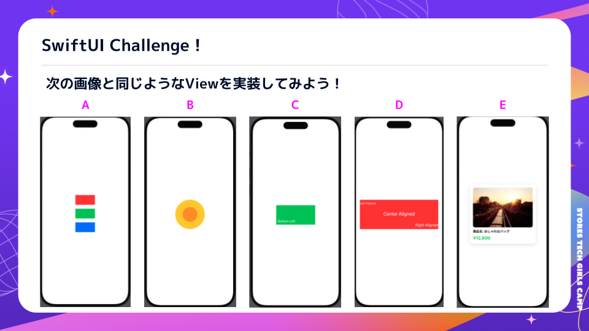

# 🎯 SwiftUI Challenge

このセクションでは、これまで学んだ SwiftUI の基本を活かして、  
自分でレイアウトを組んでみる課題に挑戦します。  
指定されたレイアウトを再現してみましょう。

---

## 🎯 目標
- SwiftUI の基本レイアウトを活用する  
- プレビューで確認しながらコードを書いてみる  

---

## 📂 プロジェクトの構成

このワークショップでは、あらかじめスタート用のプロジェクトを用意しています。
課題のレイアウトは **ChallengeProjects** に、完成版の解答例は **CompletedProjects** に用意されています。

```
📁 ChallengeProjects/
  ├── 📂 SwiftUIChallenge/      # チャレンジのスタート用プロジェクト
  │   ├── SwiftUIChallenge.xcodeproj
  │   ├── SwiftUIChallengeApp.swift
  │   ├── aView.swift           # ここに課題を実装する
  │   ├── bView.swift           # ここに課題を実装する
  │   ├── cView.swift           # ここに課題を実装する
  │   ├── dView.swift           # ここに課題を実装する
  │   ├── eView.swift           # ここに課題を実装する
  │   ├── README.md (この説明ファイル)
  │
📁 CompletedProjects/
  ├── 📂 SwiftUIChallenge/      # 完成版プロジェクト
  │   ├── SwiftUIChallenge.xcodeproj
  │   ├── SwiftUIChallengeApp.swift
  │   ├── aView.swift           # 解答例が記述されている
  │   ├── bView.swift           # 解答例が記述されている
  │   ├── cView.swift           # 解答例が記述されている
  │   ├── dView.swift           # 解答例が記述されている
  │   ├── eView.swift           # 解答例が記述されている
  │   ├── README.md
```

---

## 🏁 プロジェクトの起動

まず、スタート用のプロジェクトを開いてみましょう。

### 1. Xcode でプロジェクトを開く
以下の手順で Xcode を起動します。

```sh
open ChallengeProjects/SwiftUIChallenge/SwiftUIChallenge.xcodeproj
```

もしくは、Finder で `ChallengeProjects/SwiftUIChallenge/` を開いて、
`SwiftUIChallenge.xcodeproj` を **ダブルクリック** してください。

---

## 🔥 チャレンジ課題

以下の画像のようなレイアウトを作ってみましょう。  
それぞれのレイアウトを **VStack, HStack, ZStack を使って再現** してください。



---

### **a. 縦に3つの色付き長方形を等間隔で配置**

**ヒント**
- VStack を使う
- Rectangle を使って四角を作る
- frame でサイズを指定する

---

### **b. 二重に丸を配置**

**ヒント**
- ZStack を使う
- Circle を使って丸を作る
- frame でサイズを調整する

---

### **c. テキストを四角形の左下に配置**

**ヒント**
- ZStack を使う
- Rectangle を背景にする
- Text を配置し、alignment を調整する

---

### **d. 四角形の中に3つのテキストを等間隔に配置（異なるアライメント）**

**ヒント**
- VStack を使う
- frame の alignment を調整する

---

### **e. 商品アイテムのカードデザイン**

**目標レイアウト**  
🖼 商品画像  
📌 商品名  
💰 価格  

**ヒント**
- VStack を使う
- AsyncImage で画像を表示する
- Text を並べてデザインする

---

## ⏳ 取り組み方
1. まずは **VStack, HStack, ZStack を組み合わせてレイアウトを考える**  
2. `#Preview` を使い、プレビューで確認しながら調整する  
3. 各課題ごとに `struct ChallengeXView` を作成してコードを書く  

---

## ✅ まとめ
- VStack, HStack, ZStack を組み合わせてレイアウトを作る  
- frame や alignment を調整しながらデザインを整える  
- プレビューを活用し、試行錯誤しながら実装する  

課題が終わったら、次のステップで解答例を確認してみましょう。  
自分のコードと比べて、違いを見つけることも学習になります。

➡️ [次へ: SwiftUI Challenge 解答](./05_swiftui_challenge_answers.md)
