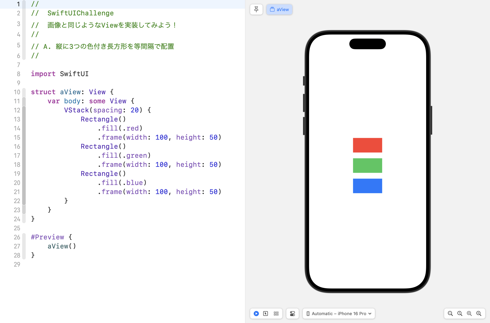
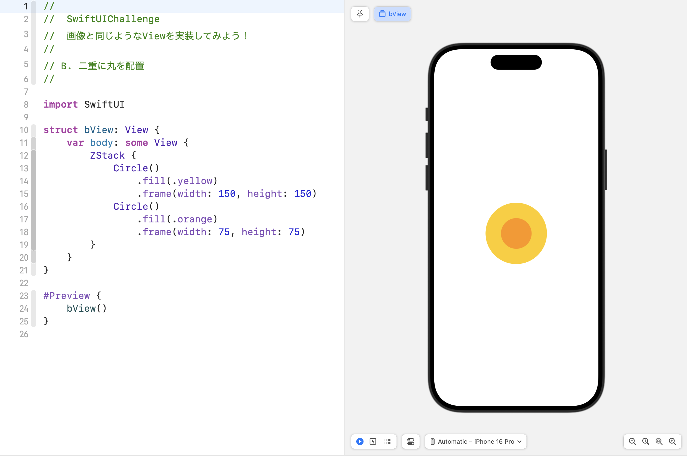
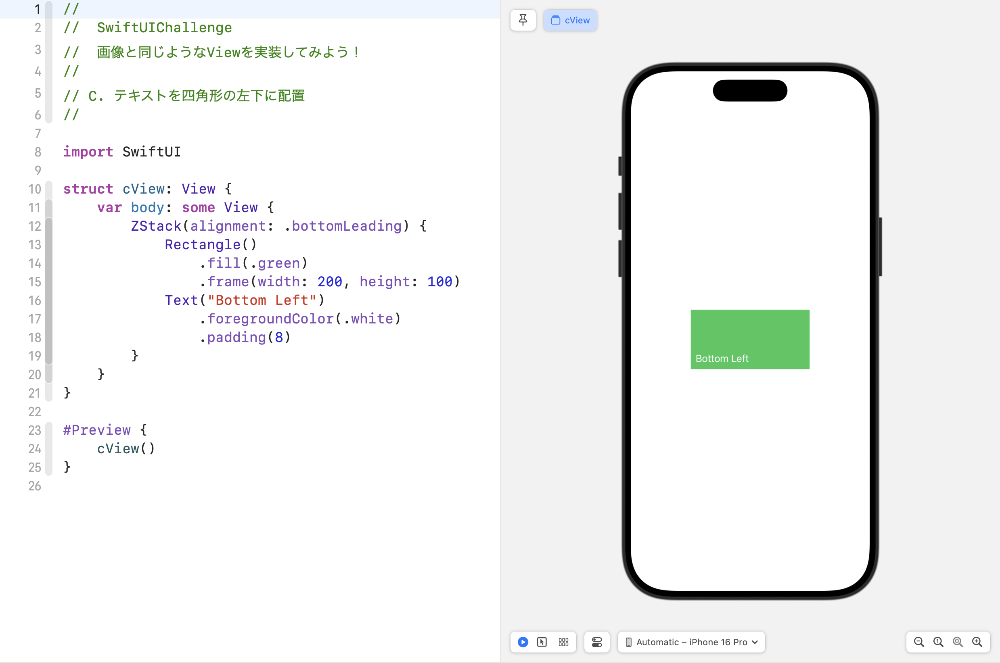
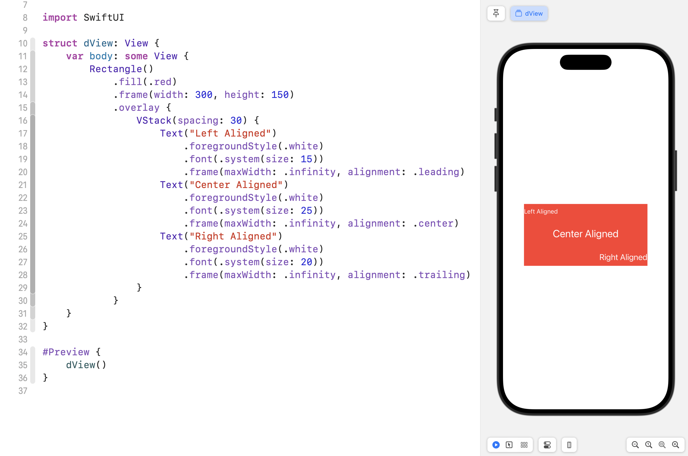
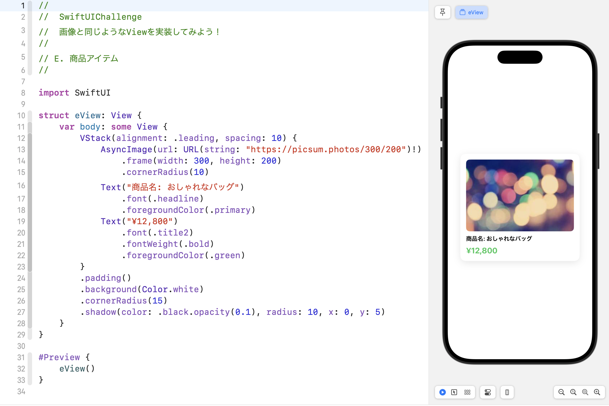

# 🎯 SwiftUI Challenge 解答

このセクションでは、前のチャレンジ課題の解答例を紹介します。  
自分のコードと見比べて、どのように実装したかを確認してみましょう。

---

## ✅ a. 縦に3つの色付き長方形を等間隔で配置

```swift
#Preview {
    VStack(spacing: 20) {
        Rectangle()
            .fill(Color.red)
            .frame(width: 100, height: 50)
        Rectangle()
            .fill(Color.green)
            .frame(width: 100, height: 50)
        Rectangle()
            .fill(Color.blue)
            .frame(width: 100, height: 50)
    }
}
```

- VStack を使い、spacing で間隔を調整する  
- Rectangle の fill で色を設定する  
- frame でサイズを指定する  



---

## ✅ b. 二重に丸を配置

```swift
#Preview {
    ZStack {
        Circle()
            .fill(Color.yellow)
            .frame(width: 150, height: 150)
        Circle()
            .fill(Color.orange)
            .frame(width: 75, height: 75)
    }
}
```

- ZStack を使って、丸を重ねる  
- Circle の fill で色を設定する  
- frame を調整し、内側の丸を小さくする  



---

## ✅ c. テキストを四角形の左下に配置

```swift
#Preview {
    ZStack(alignment: .bottomLeading) {
        Rectangle()
            .fill(Color.green)
            .frame(width: 200, height: 100)
        Text("Bottom Left")
            .foregroundColor(.white)
            .padding(8)
    }
}
```

- ZStack の alignment を `.bottomLeading` に設定する  
- Rectangle を背景として配置する  
- Text を white にして、見やすくする  



---

## ✅ d. 四角形の中に3つのテキストを等間隔に配置（異なるアライメント）

```swift
#Preview {
    Rectangle()
        .fill(Color.red)
        .frame(width: 300, height: 150)
        .overlay {
            VStack(spacing: 30) {
                Text("Left Aligned")
                    .foregroundColor(.white)
                    .font(.system(size: 15))
                    .frame(maxWidth: .infinity, alignment: .leading)
                Text("Center Aligned")
                    .foregroundColor(.white)
                    .font(.system(size: 25))
                    .frame(maxWidth: .infinity, alignment: .center)
                Text("Right Aligned")
                    .foregroundColor(.white)
                    .font(.system(size: 20))
                    .frame(maxWidth: .infinity, alignment: .trailing)
            }
        }
}
```

- VStack の中に 3 つの Text を配置する  
- frame の alignment を `.leading`, `.center`, `.trailing` に設定する  
- Text のサイズを変更し、違いを強調する  



---

## ✅ e. 商品アイテムのカードデザイン

```swift
#Preview {
    VStack(alignment: .leading, spacing: 10) {
        AsyncImage(url: URL(string: "https://picsum.photos/300/200")!)
            .frame(width: 300, height: 200)
            .cornerRadius(10)
        Text("商品名: おしゃれなバッグ")
            .font(.headline)
            .foregroundColor(.primary)
        Text("¥12,800")
            .font(.title2)
            .fontWeight(.bold)
            .foregroundColor(.green)
    }
    .padding()
    .background(Color.white)
    .cornerRadius(15)
    .shadow(color: .black.opacity(0.1), radius: 10, x: 0, y: 5)
}
```

- VStack を使って、商品画像・商品名・価格を並べる  
- AsyncImage を使って、Webから画像を読み込む  
- cornerRadius や shadow で、デザインを整える  



---

## 🏁 解答例を確認する

完成版のプロジェクトは `CompletedProjects/SwiftUIChallenge/` に用意されています。

```sh
open CompletedProjects/SwiftUIChallenge/SwiftUIChallenge.xcodeproj
```

---


## ✅ まとめ
- VStack, HStack, ZStack を使い、レイアウトを構築できる  
- frame, alignment, padding などを活用し、デザインを調整できる  
- 色や影を加えることで、見た目を改善できる  

これで SwiftUI の基本レイアウトの練習は完了です。  
次のステップでは、応用編として実際のアプリを作ってみます。

➡️ [次へ: 電卓アプリを作ってみよう](./06_calculator_app.md)
