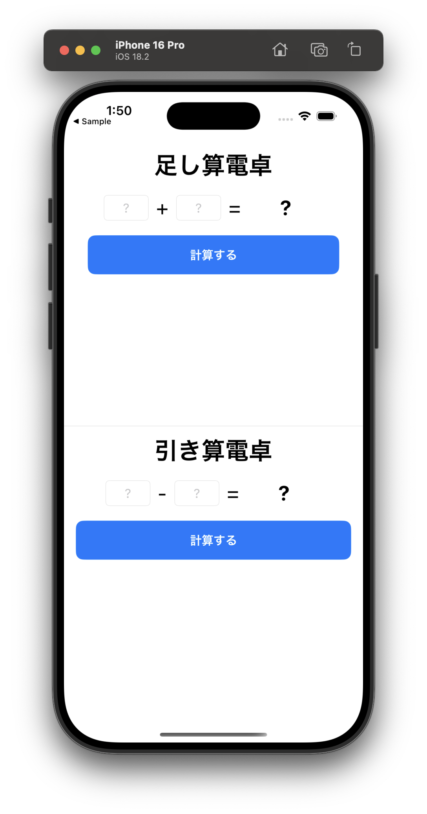

# 🏗 ワークショップ: 電卓アプリを作ってみよう！

このワークショップでは、簡単な電卓アプリを作成します。  
SwiftUI を使い、ユーザーが入力した数値を足し算・引き算できるアプリを作ります。  
Xcode のシミュレーターで動かしながら、アプリの動作を確認してみましょう。



---

## 目標
- ユーザーが入力した数値を取得する方法を学ぶ  
- SwiftUI の `TextField` を使って数値入力を実装する  
- 計算結果を画面に表示する  
- 実際に動くアプリを作り、アプリ開発の流れを体験する  

---

## プロジェクトの構成

このワークショップでは、あらかじめスタート用のプロジェクトを用意しています。  
課題の実装を行うプロジェクトは **ChallengeProjects** に、完成版の解答例は **CompletedProjects** にあります。

```
📁 ChallengeProjects/
  ├── 📂 CalculatorApp/                   # ワークショップのベースプロジェクト
  │   ├── CalculatorApp.xcodeproj
  │   ├── CalculatorApp/
  │   │   ├── CalculatorApp.swift
  │   │   ├── CalculatorView.swift        # ここに課題を実装する
  │   │   ├── ...
  │   ├── Documents/
  │   │   ├── step1/                      # Step 1 の進め方
  │   │   ├── step2/                      # Step 2 の進め方
  │   ├── README.md (この説明ファイル)
  │
📁 CompletedProjects/
  ├── 📂 CalculatorApp/                   # 完成した電卓アプリのプロジェクト
  │   ├── CalculatorApp.xcodeproj
  │   ├── CalculatorApp/
  │   │   ├── CalculatorApp.swift
  │   │   ├── CalculatorView.swift        # 解答例が記述されている
  │   │   ├── ...
  │   ├── README.md
```

---

## プロジェクトの起動

まず、スタート用のプロジェクトを開いてみましょう。

### 1. Xcode でプロジェクトを開く
以下の手順で Xcode を起動します。

```sh
open ChallengeProjects/CalculatorApp/CalculatorApp.xcodeproj
```

もしくは、Finder で `ChallengeProjects/CalculatorApp/` を開いて、  
`CalculatorApp.xcodeproj` をダブルクリックしてください。

---

## ワークショップの流れ

このワークショップでは、以下の流れで電卓アプリを完成させます。

### Step 1: 足し算機能の実装
- `calculateSum` メソッドを実装し、2つの数値を足し算できるようにする。
- 入力された値を `Int` 型に変換し、計算結果を `result` に保存する。

➡️ [Step 1 - 足し算機能を実装する](../ChallengeProjects/CalculatorApp/CalculatorApp/Documents/step1.md)

---

### Step 2: 引き算機能の追加
- `calculateSubtraction` メソッドを追加し、引き算もできるようにする。
- 足し算の処理を応用し、引き算のロジックを実装する。

➡️ [Step 2 - 引き算機能を追加する](../ChallengeProjects/CalculatorApp/CalculatorApp/Documents/step2.md)

---

## 完成版プロジェクト

すべてのステップが完了したら、完成版のプロジェクトを確認してみましょう。  
完成版のプロジェクトは `CompletedProjects/CalculatorApp/` に用意されています。

```sh
open CompletedProjects/CalculatorApp/CalculatorApp.xcodeproj
```

### 完成版のコードと解説
- `CompletedProjects/CalculatorApp/CalculatorApp/` に **完成版のコード** があります。  

自分のコードと比較して、実装の違いを学んでみましょう。

---

## 次のチャレンジ

➡️ [次へ: サーバーと通信するモバイルアプリ](./07_network_intro.md)
