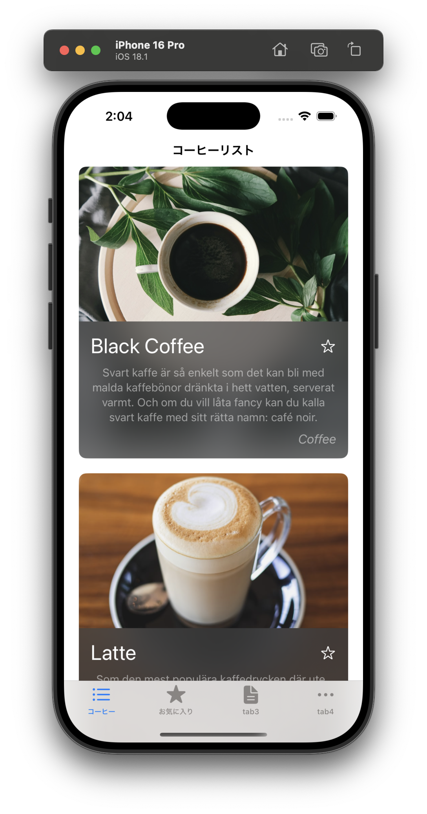

# 🌐 ワークショップ: サーバーと通信するモバイルアプリを作ってみよう！

このワークショップでは、ネットワーク通信を利用してデータを取得し、アプリに表示する機能を実装します。  
SwiftUI を使い、API からコーヒーのデータを取得し、それをリスト表示するアプリを作成します。



---

## 目標
- **サーバーと通信するアプリの仕組みを理解する**  
- **SwiftUI を使ってリスト表示を作成する**  
- **ForEach を使って動的にデータを表示する**  
- **URLSession を使って API からデータを取得する**  
- **取得したデータを Swift の構造体にマッピングする**  
- **画面遷移やタブを利用してアプリを整理する**

---

## プロジェクトの構成

このワークショップでは、スタート用のプロジェクトを **ChallengeProjects** に、完成版の解答例を **CompletedProjects** に用意しています。

```
📁 ChallengeProjects/
  ├── 📂 NetworkedApp/                      # ワークショップのベースプロジェクト
  │   ├── NetworkedApp.xcodeproj
  │   ├── NetworkedApp/
  │   │   ├── NetworkedApp.swift
  │   │   ├── CoffeeListView.swift       # コーヒーのリスト画面
  │   │   ├── CoffeeItemView.swift       # 1つのコーヒーアイテムのビュー
  │   │   ├── CoffeeDetailView.swift     # コーヒー詳細画面（未実装）
  │   │   ├── Coffee.swift               # コーヒーデータの構造体
  │   │   ├── Assets.xcassets/           # アセット管理
  │   ├── Documents/
  │   │   ├── Step0/                     # Step 0 の説明資料
  │   │   ├── Step1/                     # Step 1 の説明資料
  │   │   ├── Step2/                     # Step 2 の説明資料
  │   │   ├── Step3/                     # Step 3 の説明資料
  │   │   ├── Step4/                     # Step 4 の説明資料
  │   │   ├── Step5/                     # Step 5 の説明資料
  │   ├── README.md (この説明ファイル)
  │
📁 CompletedProjects/
  ├── 📂 NetworkedApp/                   # 完成したプロジェクト
  │   ├── NetworkedApp.xcodeproj
  │   ├── NetworkedApp/
  │   ├── README.md
```

---

## プロジェクトの起動

まず、スタート用のプロジェクトを開いてみましょう。

### 1. Xcode でプロジェクトを開く
以下の手順で Xcode を起動します。

```sh
open ChallengeProjects/NetworkedApp/NetworkedApp.xcodeproj
```

もしくは、Finder で `ChallengeProjects/NetworkedApp/` を開いて、  
`NetworkedApp.xcodeproj` をダブルクリックしてください。

---

## ワークショップの流れ

このワークショップでは、以下の流れでアプリを完成させます。

### Step 0: ベースコードを確認しよう
- プロジェクトのフォルダ構成を確認する。
- どのファイルが何をするのかを把握する。
- すでに書かれているコードを実行してみる。

➡️ [Step 0 - ベースコードを確認しよう](../ChallengeProjects/NetworkedApp/NetworkedApp/Documents/Step0.md)

---

### Step 1: アイテムセルを複数個縦に並べる
- `VStack` を使って、コーヒーアイテムを複数並べる。
- データは直接コードに書いて（ハードコーディング）、リストの基本を理解する。

➡️ [Step 1 - アイテムセルを複数個縦に並べる](../ChallengeProjects/NetworkedApp/NetworkedApp/Documents/Step1.md)

---

### Step 2: ForEach を使ってリストを整理する
- `ForEach` を使って、リストをシンプルにする。
- 配列データを作成し、ForEach で動的に表示する。

➡️ [Step 2 - ForEach を使ってリストを整理する](../ChallengeProjects/NetworkedApp/NetworkedApp/Documents/Step2.md)

---

### Step 3: API からデータを取得する
- `URLSession` を使い、API からデータを取得する。
- 取得した JSON を `Coffee` 構造体に変換する。

➡️ [Step 3 - API からデータを取得する](../ChallengeProjects/NetworkedApp/NetworkedApp/Documents/Step3.md)

---

### Step 4: 画面遷移を実装する
- `NavigationStack` と `NavigationLink` を使って、コーヒーの詳細画面を表示する。

➡️ [Step 4 - 画面遷移を実装する](../ChallengeProjects/NetworkedApp/NetworkedApp/Documents/Step4.md)

---

### Step 5: タブをつける
- `TabView` を利用して、リスト画面とお気に入り画面を切り替えられるようにする。
- タブのアイコンを設定し、使いやすい UI にする。

➡️ [Step 5 - タブをつける](../ChallengeProjects/NetworkedApp/NetworkedApp/Documents/Step5.md)

---

## 完成版プロジェクト

すべてのステップが完了したら、完成版のプロジェクトを確認してみましょう。  
完成版のプロジェクトは `CompletedProjects/NetworkedApp/` に用意されています。

```sh
open CompletedProjects/NetworkedApp/NetworkedApp.xcodeproj
```

自分のコードと比較して、実装の違いを学んでみましょう。

---

## もっとやってみよう

このワークショップが終わったら、いろいろな API を試してみましょう。  
例えば、天気予報 API やニュース API など、いろいろなデータを取得して表示するアプリを作ることができます。

- **別の API を試す**  
  例: 天気予報 API、ニュース API、映画データ API など
- **デザインを変えてみる**  
  例: `List` を使ってみる、セルのデザインを変更する
- **データを保存してみる**  
  例: `UserDefaults` や `CoreData` を使って、お気に入りを保存する

お疲れ様でした！ 🎉

## 今後について

➡️ [次へ: 📚 さらに学んでみたい人へ](./09_further.md)

